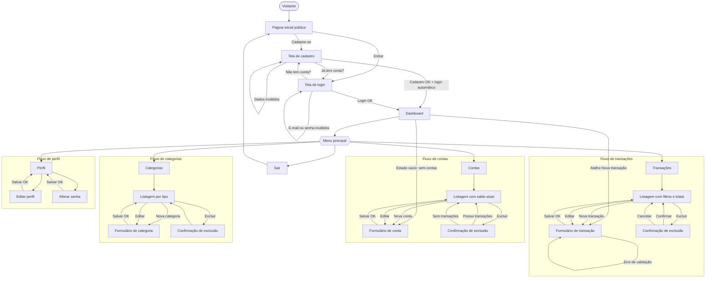
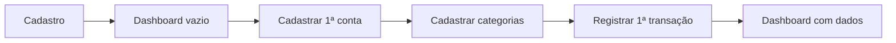
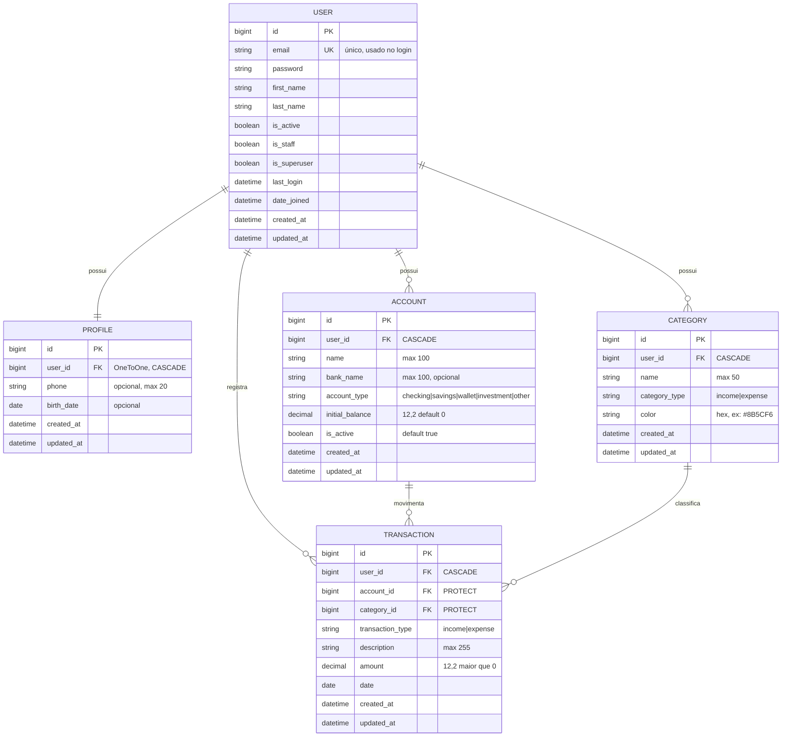
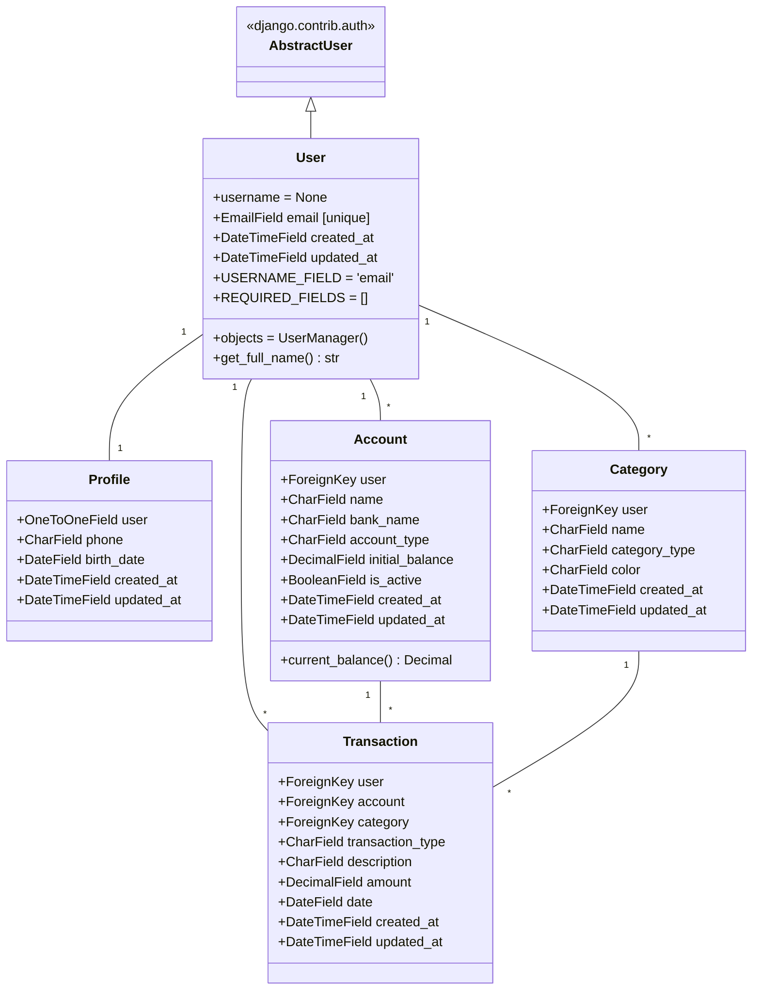

# PRD — Finanpy

> **Product Requirement Document**
> Sistema de gestão de finanças pessoais
> Versão: 1.0 · Data: 23/09/2026 · Status: Em definição

---

## Sumário

1. [Visão geral](#1-visão-geral)
2. [Sobre o produto](#2-sobre-o-produto)
3. [Propósito](#3-propósito)
4. [Público alvo](#4-público-alvo)
5. [Objetivos](#5-objetivos)
6. [Requisitos funcionais](#6-requisitos-funcionais)
7. [Requisitos não-funcionais](#7-requisitos-não-funcionais)
8. [Arquitetura técnica](#8-arquitetura-técnica)
9. [Design system](#9-design-system)
10. [User stories](#10-user-stories)
11. [Métricas de sucesso](#11-métricas-de-sucesso)
12. [Riscos e mitigações](#12-riscos-e-mitigações)
13. [Lista de tarefas](#13-lista-de-tarefas)

---

## 1. Visão geral

O **Finanpy** é uma aplicação web de gestão de finanças pessoais, construída com **Python + Django full stack**, com interface renderizada pelo **Django Template Language (DTL)** e estilizada com **TailwindCSS**. O sistema permite que o usuário cadastre suas contas bancárias, organize categorias de entradas e saídas, registre transações e acompanhe sua situação financeira por meio de um dashboard.

O projeto segue uma filosofia **simples e enxuta**: sem over engineering, priorizando recursos nativos do Django (Class Based Views, sistema de autenticação, admin, ORM, mensagens) e um banco de dados SQLite padrão.

| Item | Definição |
|---|---|
| Nome | Finanpy |
| Tipo | Aplicação web (monolito Django full stack) |
| Linguagem do código | Inglês |
| Idioma da interface | Português brasileiro (pt-BR) |
| Banco de dados | SQLite (padrão do Django) |
| Frontend | Django Template Language + TailwindCSS |
| Autenticação | Nativa do Django, com login por **e-mail** |

---

## 2. Sobre o produto

O Finanpy é composto por duas áreas:

- **Site público (apresentação):** página inicial que apresenta o produto e oferece as ações **Cadastre-se** e **Entrar**.
- **Área autenticada (sistema):** acessível somente após login. O usuário é direcionado ao **Dashboard** e navega entre os módulos:
  - **Dashboard** — resumo financeiro (saldo total, entradas e saídas do mês, resultado do mês, saldo por conta, gastos por categoria e últimas transações).
  - **Contas** — cadastro das contas bancárias do usuário (conta corrente, poupança, carteira etc.) com saldo inicial.
  - **Categorias** — categorias de lançamentos, separadas em **entrada** e **saída**.
  - **Transações** — lançamentos de entradas e saídas vinculados a uma conta e a uma categoria.
  - **Perfil** — dados pessoais do usuário e alteração de senha.

As responsabilidades de domínio são isoladas em apps Django: `users`, `profiles`, `accounts`, `categories` e `transactions`, com `core` concentrando as configurações globais.

---

## 3. Propósito

Oferecer uma ferramenta **simples, bonita e objetiva** para que pessoas controlem suas finanças pessoais sem a complexidade de planilhas ou de aplicativos sobrecarregados de funcionalidades.

O Finanpy responde a três perguntas do usuário:

1. **Quanto dinheiro eu tenho agora?** (saldo total e por conta)
2. **Quanto entrou e quanto saiu neste mês?** (entradas, saídas e resultado)
3. **Com o que eu estou gastando?** (gastos agrupados por categoria)

---

## 4. Público alvo

| Persona | Descrição | Necessidade principal |
|---|---|---|
| **Jovem profissional** | 20 a 35 anos, primeiro emprego ou início de carreira, usa 1 a 3 contas bancárias. | Entender para onde vai o salário no fim do mês. |
| **Organizador doméstico** | 30 a 55 anos, responsável pelas contas da casa. | Registrar gastos fixos e variáveis e acompanhar o saldo. |
| **Autônomo / freelancer** | Renda variável, várias entradas no mês. | Visualizar entradas x saídas e o resultado mensal. |
| **Iniciante em finanças** | Nunca controlou gastos de forma sistemática. | Ferramenta fácil, sem curva de aprendizado. |

Características comuns: usam computador e celular (interface responsiva), falam português e preferem interfaces modernas com tema escuro.

---

## 5. Objetivos

### 5.1 Objetivos de produto

- **O1** — Permitir que um novo usuário se cadastre e registre sua primeira transação em menos de 3 minutos.
- **O2** — Exibir no dashboard, em uma única tela, a posição financeira atual e do mês corrente.
- **O3** — Garantir isolamento total dos dados: cada usuário vê e altera apenas seus próprios registros.
- **O4** — Entregar uma identidade visual única e consistente em todas as telas (design system).

### 5.2 Objetivos técnicos

- **T1** — Código simples, legível, em inglês, seguindo a PEP 8 e usando aspas simples.
- **T2** — Máximo uso de recursos nativos do Django (CBVs, auth, forms, messages, admin, ORM).
- **T3** — Separação de domínios em apps Django independentes.
- **T4** — Todas as models com os campos `created_at` e `updated_at`.

### 5.3 Fora do escopo (nesta versão)

- Transferências entre contas, orçamentos/metas, contas recorrentes, parcelamentos e cartão de crédito.
- Importação de extratos (OFX/CSV), exportação de relatórios e gráficos com bibliotecas JavaScript.
- Recuperação de senha por e-mail, login social e autenticação em dois fatores.
- API REST, SPA ou qualquer framework JavaScript.
- Multimoeda (o sistema opera somente em Real — R$).
- Docker e testes automatizados **nas sprints iniciais** (previstos para as sprints finais).

---

## 6. Requisitos funcionais

### 6.1 Site público

| ID | Requisito |
|---|---|
| RF01 | O sistema deve exibir uma página inicial pública (`/`) apresentando o Finanpy, com seções de destaque (hero), funcionalidades e chamada para ação. |
| RF02 | A página inicial deve ter os botões **Cadastre-se** e **Entrar** no cabeçalho e no hero. |
| RF03 | Usuário já autenticado que acessar a página inicial deve ver o botão **Ir para o dashboard** no lugar de Cadastre-se/Entrar. |

### 6.2 Usuários e autenticação

| ID | Requisito |
|---|---|
| RF04 | O usuário deve conseguir se cadastrar informando **nome, sobrenome, e-mail, senha e confirmação de senha**. |
| RF05 | O e-mail deve ser único no sistema e é o identificador de login (não existe campo `username`). |
| RF06 | O login deve ser feito com **e-mail e senha**, usando o sistema de autenticação nativo do Django. |
| RF07 | Após o cadastro, o usuário deve ser autenticado automaticamente e redirecionado ao dashboard. |
| RF08 | Após o login, o usuário deve ser redirecionado ao **dashboard**. |
| RF09 | O usuário deve conseguir sair do sistema (logout) e ser redirecionado à página inicial. |
| RF10 | Todas as páginas da área autenticada devem exigir login; acessos anônimos são redirecionados para a tela de login. |
| RF11 | Mensagens de erro de autenticação devem ser exibidas em português (ex.: "E-mail ou senha inválidos"). |

### 6.3 Perfil

| ID | Requisito |
|---|---|
| RF12 | Um perfil (`Profile`) deve ser criado automaticamente quando um usuário é criado (signal em `profiles/signals.py`). |
| RF13 | O usuário deve visualizar e editar seu perfil: nome, sobrenome, telefone e data de nascimento. |
| RF14 | O usuário deve conseguir alterar sua senha (view nativa `PasswordChangeView`). |

### 6.4 Contas bancárias

| ID | Requisito |
|---|---|
| RF15 | O usuário deve cadastrar contas com: nome, banco/instituição, tipo (Conta corrente, Poupança, Carteira, Investimento, Outro) e saldo inicial. |
| RF16 | O usuário deve listar, editar e excluir suas contas. |
| RF17 | A listagem deve exibir o **saldo atual** de cada conta: `saldo inicial + entradas − saídas`. |
| RF18 | O usuário deve poder marcar uma conta como inativa; contas inativas não aparecem no formulário de transação. |
| RF19 | Não deve ser possível excluir uma conta que possua transações; o sistema exibe uma mensagem orientando o usuário. |

### 6.5 Categorias

| ID | Requisito |
|---|---|
| RF20 | O usuário deve cadastrar categorias com: nome, tipo (**Entrada** ou **Saída**) e cor. |
| RF21 | O usuário deve listar (separadas por tipo), editar e excluir suas categorias. |
| RF22 | Não pode haver duas categorias com o mesmo nome e tipo para o mesmo usuário. |
| RF23 | Não deve ser possível excluir uma categoria que possua transações; o sistema exibe uma mensagem orientando o usuário. |

### 6.6 Transações

| ID | Requisito |
|---|---|
| RF24 | O usuário deve registrar transações com: tipo (Entrada/Saída), descrição, valor, data, conta e categoria. |
| RF25 | O valor deve ser sempre positivo; o tipo define se soma ou subtrai do saldo. |
| RF26 | A categoria escolhida deve ser do mesmo tipo da transação. |
| RF27 | Os campos de conta e categoria devem listar somente registros do próprio usuário. |
| RF28 | O usuário deve listar suas transações ordenadas por data (mais recentes primeiro), com paginação. |
| RF29 | A listagem deve permitir filtrar por período (data inicial e final), tipo, conta e categoria. |
| RF30 | A listagem deve exibir o total de entradas, saídas e o saldo do resultado filtrado. |
| RF31 | O usuário deve editar e excluir transações (exclusão com tela de confirmação). |

### 6.7 Dashboard

| ID | Requisito |
|---|---|
| RF32 | Exibir o **saldo total** (soma do saldo atual de todas as contas ativas). |
| RF33 | Exibir o total de **entradas do mês**, **saídas do mês** e o **resultado do mês** (entradas − saídas). |
| RF34 | Exibir o **saldo por conta**. |
| RF35 | Exibir os **gastos do mês por categoria**, com barra de proporção em relação ao total de saídas (HTML/CSS, sem bibliotecas de gráfico). |
| RF36 | Exibir as **últimas 5 transações** com link para a listagem completa. |
| RF37 | Exibir atalhos para **Nova transação**, **Nova conta** e **Nova categoria**. |
| RF38 | Exibir estados vazios orientativos quando não houver dados (ex.: "Cadastre sua primeira conta"). |

### 6.8 Feedback e navegação

| ID | Requisito |
|---|---|
| RF39 | Toda ação de criar, editar e excluir deve exibir uma mensagem de feedback (framework `messages` do Django). |
| RF40 | A área autenticada deve ter um menu lateral (desktop) e um menu recolhível (mobile) com: Dashboard, Transações, Contas, Categorias, Perfil e Sair. |
| RF41 | O item de menu da página atual deve ficar destacado. |

### 6.9 Fluxos de UX



**Fluxo de primeira utilização (onboarding implícito):**



---

## 7. Requisitos não-funcionais

| ID | Categoria | Requisito |
|---|---|---|
| RNF01 | Simplicidade | Nada além do solicitado. Sem camadas extras (services, repositories), sem bibliotecas desnecessárias. |
| RNF02 | Padrões de código | Código em inglês, PEP 8, **aspas simples** sempre que possível, linhas de até 79 caracteres. |
| RNF03 | Recursos nativos | Priorizar Class Based Views genéricas (`TemplateView`, `ListView`, `CreateView`, `UpdateView`, `DeleteView`), `LoginView`, `LogoutView`, `PasswordChangeView`, `ModelForm`, `messages` e `admin`. |
| RNF04 | Organização | Cada domínio em sua própria app Django. Signals obrigatoriamente em `signals.py` da app correspondente, registrados em `apps.py` (`ready()`). |
| RNF05 | Idioma | Toda informação da interface em português brasileiro, inclusive `verbose_name`, labels, mensagens de erro e de sucesso. `LANGUAGE_CODE = 'pt-br'`. |
| RNF06 | Localização | Fuso `America/Sao_Paulo`; datas em `dd/mm/aaaa`; valores monetários em `R$ 1.234,56`. |
| RNF07 | Banco de dados | Somente SQLite padrão do Django (`db.sqlite`). |
| RNF08 | Auditoria | Todas as models devem ter `created_at` (`auto_now_add=True`) e `updated_at` (`auto_now=True`). |
| RNF09 | Segurança | Todas as views privadas com `LoginRequiredMixin`; querysets sempre filtrados por `request.user`; CSRF ativo; logout via POST; validadores de senha nativos do Django. |
| RNF10 | Isolamento de dados | Um usuário nunca pode ver, editar ou excluir dados de outro usuário (acesso a ID alheio retorna 404). |
| RNF11 | Precisão monetária | Valores em `DecimalField(max_digits=12, decimal_places=2)`; nunca `float`. |
| RNF12 | Responsividade | Layout mobile-first, funcional a partir de 360px de largura. |
| RNF13 | Consistência visual | Todas as telas usam o mesmo layout base, os mesmos componentes e os mesmos tokens do design system. |
| RNF14 | Desempenho | Páginas devem carregar em menos de 1s em ambiente local; uso de `select_related` e agregações no banco para evitar N+1. |
| RNF15 | Acessibilidade | Contraste mínimo AA, `label` associado a todo input, foco visível em elementos interativos. |
| RNF16 | Frontend | Sem frameworks JavaScript. JS apenas pontual e inline mínimo (ex.: abrir/fechar menu mobile). |
| RNF17 | Entrega | Docker e testes automatizados somente nas sprints finais. |

---

## 8. Arquitetura técnica

### 8.1 Stack

| Camada | Tecnologia | Observação |
|---|---|---|
| Linguagem | Python 3.12+ | |
| Framework | Django 5.x (LTS mais recente disponível) | Full stack, monolito |
| Templates | Django Template Language | Herança de templates + `include` para componentes |
| Estilo | TailwindCSS 4.x | Compilado com o **Tailwind CLI standalone** (sem Node.js) |
| Fonte | Inter (Google Fonts) | |
| Banco de dados | SQLite | Arquivo `db.sqlite` |
| Autenticação | `django.contrib.auth` | Model `User` customizada com login por e-mail |
| Admin | `django.contrib.admin` | Gestão interna dos dados |
| Qualidade | `flake8` | Checagem de PEP 8 |
| Testes (sprint final) | `django.test` (`TestCase`) | Nativo do Django |
| Container (sprint final) | Docker + Docker Compose | |

### 8.2 Estrutura de diretórios

```text
finanpy
├── accounts                # contas bancárias
│   ├── migrations/
│   ├── __init__.py
│   ├── admin.py
│   ├── apps.py
│   ├── forms.py
│   ├── models.py
│   ├── tests.py
│   ├── urls.py
│   └── views.py
├── categories              # categorias de lançamentos/transações
│   ├── migrations/
│   ├── __init__.py
│   ├── admin.py
│   ├── apps.py
│   ├── forms.py
│   ├── models.py
│   ├── tests.py
│   ├── urls.py
│   └── views.py
├── core                    # configurações globais do projeto
│   ├── __init__.py
│   ├── asgi.py
│   ├── settings.py
│   ├── urls.py
│   ├── views.py            # HomeView (site público) e DashboardView
│   └── wsgi.py
├── profiles                # perfis de usuários
│   ├── migrations/
│   ├── __init__.py
│   ├── admin.py
│   ├── apps.py
│   ├── forms.py
│   ├── models.py
│   ├── signals.py          # cria Profile ao criar User
│   ├── tests.py
│   ├── urls.py
│   └── views.py
├── transactions            # transações - entradas e saídas
│   ├── migrations/
│   ├── __init__.py
│   ├── admin.py
│   ├── apps.py
│   ├── forms.py
│   ├── models.py
│   ├── tests.py
│   ├── urls.py
│   └── views.py
├── users                   # usuários - herdando do User padrão do Django
│   ├── migrations/
│   ├── __init__.py
│   ├── admin.py
│   ├── apps.py
│   ├── forms.py
│   ├── managers.py         # UserManager para login por e-mail
│   ├── models.py
│   ├── tests.py
│   ├── urls.py
│   └── views.py
├── templates
│   ├── base.html                   # <html>, <head>, fontes, CSS
│   ├── layouts
│   │   ├── public.html             # layout do site público
│   │   ├── auth.html               # layout de login/cadastro
│   │   └── app.html                # layout autenticado (sidebar)
│   ├── components
│   │   ├── _messages.html
│   │   ├── _sidebar.html
│   │   ├── _topbar.html
│   │   ├── _form_field.html
│   │   ├── _page_header.html
│   │   ├── _stat_card.html
│   │   ├── _empty_state.html
│   │   ├── _pagination.html
│   │   └── _confirm_delete.html
│   ├── home.html
│   ├── dashboard.html
│   ├── users/  profiles/  accounts/  categories/  transactions/
├── static
│   ├── src
│   │   └── input.css               # entrada do Tailwind + design tokens
│   └── css
│       └── output.css              # CSS compilado (gerado)
├── bin
│   └── tailwindcss                 # binário standalone (não versionado)
├── db.sqlite
├── manage.py
├── requirements.txt
└── .gitignore
```

### 8.3 Decisões de arquitetura

- **Login por e-mail:** a model `users.User` herda de `AbstractUser`, remove o campo `username` (`username = None`), define `email` como único e `USERNAME_FIELD = 'email'`. Um `UserManager` customizado (`users/managers.py`) implementa `create_user` e `create_superuser`. Com isso, o `ModelBackend` e a `LoginView` nativos passam a autenticar por e-mail sem backend customizado.
- **Saldo das contas calculado, não armazenado:** o saldo atual é `initial_balance + soma(entradas) − soma(saídas)`, calculado com agregações do ORM. Evita inconsistências e dispensa signals de atualização de saldo.
- **Integridade referencial:** `Transaction.account` e `Transaction.category` usam `on_delete=models.PROTECT`; a exclusão é bloqueada e tratada na `DeleteView` com mensagem amigável.
- **Isolamento por usuário:** todas as models de domínio têm FK para `User`. As views usam `get_queryset()` filtrado por `self.request.user` e atribuem o usuário em `form_valid()`.
- **Views do site público e dashboard** ficam em `core/views.py`, pois não pertencem a um domínio específico.
- **Tailwind CLI standalone:** evita Node.js no projeto. O CSS é gerado a partir de `static/src/input.css`, varrendo os templates (`@source`).

### 8.4 Rotas (URLs)

| URL | View | Nome | Acesso |
|---|---|---|---|
| `/` | `core.HomeView` | `home` | Público |
| `/cadastro/` | `users.SignUpView` | `signup` | Público |
| `/entrar/` | `users.UserLoginView` | `login` | Público |
| `/sair/` | `LogoutView` (POST) | `logout` | Autenticado |
| `/dashboard/` | `core.DashboardView` | `dashboard` | Autenticado |
| `/perfil/` | `profiles.ProfileDetailView` | `profiles:detail` | Autenticado |
| `/perfil/editar/` | `profiles.ProfileUpdateView` | `profiles:update` | Autenticado |
| `/perfil/senha/` | `profiles.UserPasswordChangeView` | `profiles:password` | Autenticado |
| `/contas/` | `accounts.AccountListView` | `accounts:list` | Autenticado |
| `/contas/nova/` | `accounts.AccountCreateView` | `accounts:create` | Autenticado |
| `/contas/<pk>/editar/` | `accounts.AccountUpdateView` | `accounts:update` | Autenticado |
| `/contas/<pk>/excluir/` | `accounts.AccountDeleteView` | `accounts:delete` | Autenticado |
| `/categorias/` | `categories.CategoryListView` | `categories:list` | Autenticado |
| `/categorias/nova/` | `categories.CategoryCreateView` | `categories:create` | Autenticado |
| `/categorias/<pk>/editar/` | `categories.CategoryUpdateView` | `categories:update` | Autenticado |
| `/categorias/<pk>/excluir/` | `categories.CategoryDeleteView` | `categories:delete` | Autenticado |
| `/transacoes/` | `transactions.TransactionListView` | `transactions:list` | Autenticado |
| `/transacoes/nova/` | `transactions.TransactionCreateView` | `transactions:create` | Autenticado |
| `/transacoes/<pk>/editar/` | `transactions.TransactionUpdateView` | `transactions:update` | Autenticado |
| `/transacoes/<pk>/excluir/` | `transactions.TransactionDeleteView` | `transactions:delete` | Autenticado |
| `/admin/` | Django Admin | — | Superusuário |

### 8.5 Estrutura de dados

#### 8.5.1 Diagrama entidade-relacionamento



#### 8.5.2 Diagrama de classes (models Django)



#### 8.5.3 Regras de dados

| Model | Regra |
|---|---|
| `User` | `email` único e obrigatório; `username` removido. |
| `Profile` | Criado automaticamente via `post_save` de `User` (`profiles/signals.py`). |
| `Account` | `account_type` com `TextChoices`: `checking` (Conta corrente), `savings` (Poupança), `wallet` (Carteira), `investment` (Investimento), `other` (Outro). Ordenação por `name`. |
| `Category` | `category_type` com `TextChoices`: `income` (Entrada), `expense` (Saída). `UniqueConstraint(user, name, category_type)`. Ordenação por `name`. |
| `Transaction` | `amount > 0` (`MinValueValidator(Decimal('0.01'))`); `category.category_type == transaction_type` (validado no `clean()` do form). Ordenação por `-date`, `-created_at`. Índice em `(user, date)`. |

---

## 9. Design system

O design system do Finanpy é definido **uma única vez** em `static/src/input.css` (tokens + classes de componentes com `@apply`) e reutilizado em todas as telas por meio de **templates parciais** (`templates/components/`). Nenhuma tela deve criar estilos próprios fora desse padrão.

**Princípios visuais:** tema escuro, superfícies em camadas, gradientes violeta → índigo → ciano como assinatura da marca, verde para entradas, rosa para saídas, cantos arredondados generosos e bastante respiro.

### 9.1 Paleta de cores

#### Marca (primária)

| Token | Hex | Classe Tailwind | Uso |
|---|---|---|---|
| `brand-400` | `#A78BFA` | `text-brand-400` | Links, ícones ativos |
| `brand-500` | `#8B5CF6` | `bg-brand-500` | Cor primária, foco |
| `brand-600` | `#7C3AED` | `bg-brand-600` | Hover da primária |
| `accent-500` | `#6366F1` | `bg-accent-500` | Meio do gradiente (índigo) |
| `cyan-400` | `#22D3EE` | `text-cyan-400` | Fim do gradiente, destaques |

#### Fundo e superfícies

| Token | Hex | Classe Tailwind | Uso |
|---|---|---|---|
| `base` | `#0B0F1A` | `bg-base` | Fundo da página (tokens `--background-color-base` e `--ring-offset-color-base`; ver 9.2) |
| `surface` | `#111827` | `bg-surface` | Cards, sidebar |
| `surface-2` | `#1A2234` | `bg-surface-2` | Inputs, hover de linhas |
| `line` | `#263048` | `border-line` | Bordas e divisores |

#### Texto

| Token | Hex | Classe Tailwind | Uso |
|---|---|---|---|
| `ink` | `#F1F5F9` | `text-ink` | Texto principal, títulos |
| `ink-muted` | `#94A3B8` | `text-ink-muted` | Texto secundário, labels |
| `ink-faint` | `#8391A7` | `text-ink-faint` | Placeholders, legendas (≥ 4.5:1 sobre `surface-2`) |

#### Semânticas

| Token | Hex | Uso |
|---|---|---|
| `income` | `#10B981` (emerald-500) | Entradas, valores positivos, sucesso |
| `expense` | `#F43F5E` (rose-500) | Saídas, valores negativos, erro, exclusão |
| `warning` | `#F59E0B` (amber-500) | Avisos |
| `info` | `#38BDF8` (sky-400) | Informações |

#### Gradientes

| Nome | Classes | Uso |
|---|---|---|
| Marca | `bg-linear-to-r from-brand-500 via-accent-500 to-cyan-400` | Logo, destaques |
| Botão primário | `bg-linear-to-r from-brand-600 via-indigo-600 to-cyan-700` | `.btn-primary` (tons mais escuros para contraste AA com texto branco) |
| Texto marca | `bg-linear-to-r from-brand-400 to-cyan-400 bg-clip-text text-transparent` | Títulos do hero, logo |
| Fundo glow | `bg-[radial-gradient(ellipse_at_top,_rgba(139,92,246,0.18),_transparent_60%)]` | Fundo do site público e telas de auth |
| Card saldo | `bg-linear-to-br from-brand-600/30 via-accent-500/20 to-cyan-400/10` | Card de saldo total no dashboard |
| Entrada | `bg-linear-to-br from-emerald-500/20 to-emerald-500/5` | Card de entradas |
| Saída | `bg-linear-to-br from-rose-500/20 to-rose-500/5` | Card de saídas |

#### Cores sugeridas para categorias

`#8B5CF6` · `#6366F1` · `#22D3EE` · `#10B981` · `#F59E0B` · `#F43F5E` · `#EC4899` · `#84CC16` — exibidas como opções no formulário de categoria.

### 9.2 Tokens no Tailwind (`static/src/input.css`)

```css
@import 'tailwindcss';

@source '../../templates';
@source '../../**/forms.py';

@theme {
  --font-sans: 'Inter', ui-sans-serif, system-ui, sans-serif;

  --color-brand-400: #a78bfa;
  --color-brand-500: #8b5cf6;
  --color-brand-600: #7c3aed;
  --color-accent-500: #6366f1;

  /* 'base' não usa --color-base: no Tailwind 4 isso faria text-base virar
     cor em vez de tamanho de fonte. */
  --background-color-base: #0b0f1a;
  --ring-offset-color-base: #0b0f1a;
  --color-surface: #111827;
  --color-surface-2: #1a2234;
  --color-line: #263048;

  --color-ink: #f1f5f9;
  --color-ink-muted: #94a3b8;
  --color-ink-faint: #8391a7;

  --color-income: #10b981;
  --color-expense: #f43f5e;
}
```

### 9.3 Tipografia

- **Fonte:** Inter (pesos 400, 500, 600, 700), carregada via Google Fonts em `base.html`.
- **Números/valores:** sempre com `tabular-nums` para alinhar colunas.

| Elemento | Classes |
|---|---|
| Display (hero) | `text-4xl md:text-6xl font-bold tracking-tight` |
| Título de página (h1) | `text-2xl md:text-3xl font-semibold text-ink` |
| Título de seção (h2) | `text-lg font-semibold text-ink` |
| Título de card (h3) | `text-sm font-medium text-ink-muted` |
| Corpo | `text-sm md:text-base text-ink` |
| Secundário | `text-sm text-ink-muted` |
| Legenda | `text-xs text-ink-faint` |
| Valor em destaque | `text-2xl md:text-3xl font-bold tabular-nums` |
| Valor em tabela | `text-sm font-semibold tabular-nums` |

### 9.4 Botões

Todos os botões: `inline-flex items-center justify-center gap-2 rounded-xl px-4 py-2.5 text-sm font-semibold transition focus:outline-none focus-visible:ring-2 focus-visible:ring-brand-500 focus-visible:ring-offset-2 focus-visible:ring-offset-base disabled:opacity-50`.

| Variante | Classe | Estilo adicional | Uso |
|---|---|---|---|
| Primário | `.btn-primary` | `bg-linear-to-r from-brand-600 via-indigo-600 to-cyan-700 text-white shadow-lg shadow-brand-500/25 hover:brightness-110` | Ação principal (Salvar, Entrar, Nova transação) |
| Secundário | `.btn-secondary` | `bg-surface-2 text-ink border border-line hover:bg-line` | Ações alternativas (Cancelar, Voltar) |
| Fantasma | `.btn-ghost` | `text-ink-muted hover:text-ink hover:bg-surface-2` | Ações discretas em tabelas |
| Perigo | `.btn-danger` | `bg-expense/90 text-white hover:bg-expense` | Confirmar exclusão |
| Pequeno | `.btn-sm` | `px-3 py-1.5 text-xs rounded-lg` | Combinável com as variantes |

```css
@layer components {
  .btn {
    @apply inline-flex items-center justify-center gap-2 rounded-xl px-4
      py-2.5 text-sm font-semibold transition focus:outline-none
      focus-visible:ring-2 focus-visible:ring-brand-500
      focus-visible:ring-offset-2 focus-visible:ring-offset-base
      disabled:opacity-50;
  }
  .btn-primary {
    @apply btn bg-linear-to-r from-brand-600 via-indigo-600 to-cyan-700
      text-white shadow-lg shadow-brand-500/25 hover:brightness-110;
  }
  .btn-secondary {
    @apply btn bg-surface-2 text-ink border border-line hover:bg-line;
  }
  .btn-ghost {
    @apply btn text-ink-muted hover:text-ink hover:bg-surface-2;
  }
  .btn-danger {
    @apply btn bg-expense/90 text-white hover:bg-expense;
  }
}
```

> Observação: no Tailwind 4, se `@apply` de uma classe customizada (`btn`) não for suportado na versão utilizada, repetir as classes base em cada variante.

### 9.5 Inputs e formulários

| Elemento | Classe | Estilo |
|---|---|---|
| Input / select / textarea | `.input` | `w-full rounded-xl bg-surface-2 border border-line px-4 py-2.5 text-sm text-ink placeholder:text-ink-faint focus:border-brand-500 focus:ring-2 focus:ring-brand-500/30 focus:outline-none transition` |
| Input com erro | `.input-error` | `border-expense focus:border-expense focus:ring-expense/30` |
| Label | `.label` | `block mb-1.5 text-sm font-medium text-ink-muted` |
| Texto de ajuda | `.help-text` | `mt-1 text-xs text-ink-faint` |
| Mensagem de erro | `.error-text` | `mt-1 text-xs text-expense` |
| Checkbox | `.checkbox` | `h-4 w-4 rounded border-line bg-surface-2 text-brand-500 focus:ring-brand-500` |

**Padrão de formulário:**

- As classes são aplicadas nos widgets dentro do `forms.py` (atributo `attrs={'class': 'input'}`), via um mixin simples reutilizável (`StyledFormMixin`) ou diretamente em `Meta.widgets`.
- Cada campo é renderizado pelo componente `components/_form_field.html` (label + input + ajuda + erro).
- Estrutura: card (`.card`) → grid de campos (`grid grid-cols-1 md:grid-cols-2 gap-5`) → rodapé de ações (`flex justify-end gap-3 pt-6 border-t border-line`) com **Cancelar** (secundário) e **Salvar** (primário).
- Erros não relacionados a campos (`form.non_field_errors`) aparecem em um alerta de erro no topo do form.

```django
{# templates/components/_form_field.html #}
<div class="{{ wrapper_class|default:'' }}">
  <label for="{{ field.id_for_label }}" class="label">{{ field.label }}</label>
  {{ field }}
  <p class="help-text">{{ field.help_text }}</p>
  <p class="error-text">{{ error }}</p>
</div>
```

### 9.6 Cards

| Variante | Classe | Estilo |
|---|---|---|
| Card padrão | `.card` | `rounded-2xl bg-surface border border-line p-5 md:p-6 shadow-xl shadow-black/20` |
| Card destaque | `.card-highlight` | `.card` + gradiente "Card saldo" + `border-brand-500/30` |
| Card estatística | `components/_stat_card.html` | Título (`h3`), valor em destaque, legenda; cor do valor por contexto (`text-income`, `text-expense`, `text-ink`) |

### 9.7 Tabelas e listas

- Container: `.card p-0 overflow-hidden`.
- Tabela (desktop, `hidden md:table`): `w-full text-sm`; cabeçalho `bg-surface-2 text-xs uppercase tracking-wider text-ink-faint`; células `px-5 py-3.5`; linhas `border-t border-line hover:bg-surface-2/60 transition`.
- Lista (mobile, `md:hidden`): cada item é um bloco `flex items-center justify-between px-4 py-3 border-t border-line`.
- Valores: entrada `text-income` com prefixo `+`, saída `text-expense` com prefixo `−`, alinhados à direita.
- Ações de linha: botões `.btn-ghost .btn-sm` (Editar / Excluir).

### 9.8 Badges

| Classe | Estilo | Uso |
|---|---|---|
| `.badge` | `inline-flex items-center gap-1.5 rounded-full px-2.5 py-0.5 text-xs font-medium` | Base |
| `.badge-income` | `bg-income/15 text-income` | Tipo Entrada |
| `.badge-expense` | `bg-expense/15 text-expense` | Tipo Saída |
| `.badge-neutral` | `bg-surface-2 text-ink-muted border border-line` | Tipo de conta, status |
| Categoria | `.badge` + bolinha `h-2 w-2 rounded-full` com `style="background-color: {{ category.color }}"` | Categoria da transação |

### 9.9 Alertas (mensagens)

Componente `components/_messages.html`, renderizando `messages` do Django por `message.tags`:

| Tag | Estilo |
|---|---|
| `success` | `rounded-xl border border-income/30 bg-income/10 text-income px-4 py-3 text-sm` |
| `error` | `rounded-xl border border-expense/30 bg-expense/10 text-expense px-4 py-3 text-sm` |
| `warning` | `rounded-xl border border-amber-500/30 bg-amber-500/10 text-amber-400 px-4 py-3 text-sm` |
| `info` | `rounded-xl border border-sky-400/30 bg-sky-400/10 text-sky-300 px-4 py-3 text-sm` |

### 9.10 Grids e layout

| Contexto | Classes |
|---|---|
| Container público | `mx-auto max-w-6xl px-4 sm:px-6 lg:px-8` |
| Área de conteúdo (app) | `mx-auto max-w-7xl px-4 sm:px-6 lg:px-8 py-6 md:py-8` |
| Layout app | `min-h-screen bg-base text-ink lg:pl-64` (sidebar fixa de 16rem) |
| Cards de estatística | `grid grid-cols-1 sm:grid-cols-2 xl:grid-cols-4 gap-4 md:gap-6` |
| Dashboard (2 colunas) | `grid grid-cols-1 lg:grid-cols-3 gap-6` (conteúdo principal `lg:col-span-2`) |
| Formulários | `grid grid-cols-1 md:grid-cols-2 gap-5` (campos longos com `md:col-span-2`) |
| Features (landing) | `grid grid-cols-1 md:grid-cols-3 gap-6` |
| Filtros | `grid grid-cols-1 sm:grid-cols-2 lg:grid-cols-5 gap-3 items-end` |

**Breakpoints:** padrão Tailwind (`sm` 640px, `md` 768px, `lg` 1024px, `xl` 1280px). Mobile-first.

### 9.11 Menus e navegação

**Sidebar (área autenticada, `lg` para cima):**

- `fixed inset-y-0 left-0 w-64 bg-surface border-r border-line flex flex-col`.
- Topo: logo "Finanpy" com texto em gradiente de marca.
- Itens: `flex items-center gap-3 rounded-xl px-3 py-2.5 text-sm font-medium text-ink-muted hover:text-ink hover:bg-surface-2 transition`.
- Item ativo: `bg-linear-to-r from-brand-500/20 to-transparent text-ink border-l-2 border-brand-500`.
- Rodapé: nome e e-mail do usuário + botão **Sair** (form POST).
- Ícones: SVG inline (Heroicons outline, 20px), sem dependências.

**Topbar mobile (abaixo de `lg`):**

- `sticky top-0 z-30 flex items-center justify-between bg-base/80 backdrop-blur border-b border-line px-4 h-16`.
- Botão hambúrguer abre a sidebar como drawer (`-translate-x-full` ↔ `translate-x-0`), controlado por um JS inline mínimo.

**Header público:**

- `sticky top-0 z-30 bg-base/70 backdrop-blur border-b border-line/60`.
- Logo à esquerda; à direita **Entrar** (`.btn-ghost`) e **Cadastre-se** (`.btn-primary`).

**Cabeçalho de página (`components/_page_header.html`):** título (h1) + subtítulo à esquerda, ação principal (`.btn-primary`) à direita; empilha em mobile (`flex flex-col sm:flex-row sm:items-center sm:justify-between gap-4 mb-6`).

### 9.12 Componentes auxiliares

| Componente | Arquivo | Descrição |
|---|---|---|
| Estado vazio | `_empty_state.html` | Ícone em círculo com gradiente, título, texto e botão de ação. `text-center py-12`. |
| Paginação | `_pagination.html` | Botões Anterior/Próxima (`.btn-secondary .btn-sm`) + "Página X de Y"; preserva querystring dos filtros. |
| Confirmação de exclusão | `_confirm_delete.html` | Card centralizado com aviso, nome do objeto, **Cancelar** (secundário) e **Excluir** (perigo). |
| Barra de proporção | inline no dashboard | `h-2 rounded-full bg-surface-2` com preenchimento `h-2 rounded-full` na cor da categoria e `width` em %. |

### 9.13 Formatação de dados na interface

- Moeda: `R$ {{ value|floatformat:2 }}` com `USE_THOUSAND_SEPARATOR = True` e locale `pt-br` → `R$ 1.234,56`. Criar um filtro simples `currency` somente se o `floatformat` não atender.
- Datas: `{{ date|date:'d/m/Y' }}`; mês por extenso no dashboard: `{{ today|date:'F \d\e Y' }}` → "setembro de 2026".
- Inputs de data: `DateInput(attrs={'type': 'date'})`.

---

## 10. User stories

### Épico 1 — Site público

**US01 — Conhecer o produto**
> Como **visitante**, quero ver uma página de apresentação do Finanpy, para entender o que o sistema oferece antes de me cadastrar.

Critérios de aceite:
- [ ] A página `/` é acessível sem login.
- [ ] Exibe hero com título, subtítulo e botões **Cadastre-se** e **Entrar**.
- [ ] Exibe uma seção com 3 funcionalidades (Contas, Categorias, Dashboard).
- [ ] Layout responsivo e seguindo o design system (fundo escuro com glow em gradiente).
- [ ] Se o usuário já estiver logado, exibe **Ir para o dashboard**.

### Épico 2 — Cadastro e autenticação

**US02 — Criar conta**
> Como **visitante**, quero me cadastrar com nome, e-mail e senha, para começar a usar o sistema.

Critérios de aceite:
- [ ] Formulário com nome, sobrenome, e-mail, senha e confirmação de senha.
- [ ] E-mail duplicado exibe "Já existe um usuário com este e-mail."
- [ ] Senhas diferentes ou fracas exibem erros em português (validadores nativos).
- [ ] Ao concluir, o usuário é logado automaticamente e redirecionado ao dashboard com mensagem de boas-vindas.
- [ ] Um `Profile` é criado automaticamente para o novo usuário.

**US03 — Entrar com e-mail**
> Como **usuário cadastrado**, quero entrar com meu e-mail e senha, para acessar minhas finanças.

Critérios de aceite:
- [ ] O formulário possui os campos **E-mail** e **Senha** (sem username).
- [ ] Credenciais inválidas exibem "E-mail ou senha inválidos." sem revelar qual campo está errado.
- [ ] Login bem-sucedido redireciona para `/dashboard/`.
- [ ] Usuário logado que acessa `/entrar/` é redirecionado ao dashboard.

**US04 — Sair**
> Como **usuário**, quero sair do sistema, para proteger meus dados em dispositivos compartilhados.

Critérios de aceite:
- [ ] Botão **Sair** disponível na sidebar/topbar.
- [ ] Logout é feito via POST e redireciona para a página inicial.
- [ ] Após sair, acessar `/dashboard/` redireciona para o login.

### Épico 3 — Perfil

**US05 — Editar meu perfil**
> Como **usuário**, quero editar nome, sobrenome, telefone e data de nascimento, para manter meus dados atualizados.

Critérios de aceite:
- [ ] A página de perfil exibe os dados atuais e o e-mail (somente leitura).
- [ ] Salvar atualiza `User` (nome/sobrenome) e `Profile` (telefone/nascimento).
- [ ] Mensagem "Perfil atualizado com sucesso." é exibida.

**US06 — Alterar senha**
> Como **usuário**, quero alterar minha senha, para manter minha conta segura.

Critérios de aceite:
- [ ] Formulário com senha atual, nova senha e confirmação.
- [ ] Senha atual incorreta exibe erro.
- [ ] Após alterar, o usuário continua logado e vê mensagem de sucesso.

### Épico 4 — Contas bancárias

**US07 — Cadastrar conta**
> Como **usuário**, quero cadastrar minhas contas bancárias com saldo inicial, para acompanhar o saldo de cada uma.

Critérios de aceite:
- [ ] Campos: nome, banco/instituição, tipo, saldo inicial e ativa.
- [ ] A conta fica vinculada ao usuário logado.
- [ ] Mensagem "Conta criada com sucesso." e redirecionamento para a listagem.

**US08 — Listar contas e ver saldo**
> Como **usuário**, quero ver minhas contas com o saldo atual, para saber quanto tenho em cada uma.

Critérios de aceite:
- [ ] Lista somente as contas do usuário logado.
- [ ] Exibe nome, banco, tipo (badge), saldo atual e status.
- [ ] Saldo atual = saldo inicial + entradas − saídas.
- [ ] Saldo negativo aparece em `text-expense`.
- [ ] Sem contas, exibe estado vazio com botão **Nova conta**.

**US09 — Editar e excluir conta**
> Como **usuário**, quero editar ou excluir contas, para corrigir ou remover registros.

Critérios de aceite:
- [ ] Editar abre o formulário preenchido.
- [ ] Excluir exibe tela de confirmação.
- [ ] Conta com transações não é excluída; exibe "Esta conta possui transações e não pode ser excluída. Você pode desativá-la."
- [ ] Acesso a conta de outro usuário retorna 404.

### Épico 5 — Categorias

**US10 — Gerenciar categorias**
> Como **usuário**, quero criar, editar e excluir categorias de entrada e saída, para classificar minhas transações.

Critérios de aceite:
- [ ] Campos: nome, tipo (Entrada/Saída) e cor (opções da paleta).
- [ ] Listagem separada em duas seções: **Entradas** e **Saídas**, com bolinha de cor.
- [ ] Nome duplicado para o mesmo tipo exibe erro.
- [ ] Categoria com transações não pode ser excluída (mensagem explicativa).
- [ ] Acesso a categoria de outro usuário retorna 404.

### Épico 6 — Transações

**US11 — Registrar transação**
> Como **usuário**, quero registrar entradas e saídas, para manter meu controle financeiro em dia.

Critérios de aceite:
- [ ] Campos: tipo, descrição, valor, data (padrão: hoje), conta e categoria.
- [ ] Conta lista somente contas ativas do usuário; categoria lista somente categorias do usuário.
- [ ] Valor zero ou negativo exibe erro.
- [ ] Categoria de tipo diferente da transação exibe "A categoria selecionada não corresponde ao tipo da transação."
- [ ] Sem contas ou categorias, a página orienta a cadastrá-las primeiro.
- [ ] Mensagem "Transação registrada com sucesso."

**US12 — Consultar transações**
> Como **usuário**, quero listar e filtrar minhas transações, para analisar meus lançamentos.

Critérios de aceite:
- [ ] Ordenadas da mais recente para a mais antiga, 20 por página.
- [ ] Filtros: data inicial, data final, tipo, conta e categoria (combináveis).
- [ ] Paginação preserva os filtros.
- [ ] Exibe totais de entradas, saídas e saldo do resultado filtrado.
- [ ] Entradas em verde com `+`, saídas em rosa com `−`.

**US13 — Editar e excluir transação**
> Como **usuário**, quero corrigir ou remover uma transação, para manter os dados corretos.

Critérios de aceite:
- [ ] Editar abre o formulário preenchido com as mesmas validações da criação.
- [ ] Excluir exige confirmação.
- [ ] Os saldos das contas e o dashboard refletem a alteração imediatamente.

### Épico 7 — Dashboard

**US14 — Visão geral financeira**
> Como **usuário**, quero ver um resumo das minhas finanças ao entrar, para entender rapidamente minha situação.

Critérios de aceite:
- [ ] Card de **Saldo total** (contas ativas) com gradiente de destaque.
- [ ] Cards de **Entradas do mês**, **Saídas do mês** e **Resultado do mês**.
- [ ] Bloco **Saldo por conta**.
- [ ] Bloco **Gastos por categoria** do mês, com barras de proporção na cor da categoria.
- [ ] Bloco **Últimas transações** (5) com link "Ver todas".
- [ ] Atalhos para nova transação, nova conta e nova categoria.
- [ ] Estados vazios orientativos quando não há dados.
- [ ] Mês de referência exibido por extenso (ex.: "setembro de 2026").

### Épico 8 — Identidade visual e navegação

**US15 — Navegação consistente**
> Como **usuário**, quero que todas as telas tenham o mesmo visual e menu, para usar o sistema com fluidez.

Critérios de aceite:
- [ ] Todas as telas autenticadas estendem `layouts/app.html`.
- [ ] Sidebar no desktop e drawer no mobile, com item ativo destacado.
- [ ] Botões, inputs, cards, tabelas e alertas usam exclusivamente as classes do design system.
- [ ] Todas as telas funcionam em 360px de largura sem rolagem horizontal.

### Épico 9 — Qualidade e entrega (sprints finais)

**US16 — Testes automatizados**
> Como **desenvolvedor**, quero testes automatizados das regras principais, para evoluir o sistema com segurança.

Critérios de aceite:
- [ ] Testes de models, forms e views de todas as apps com `django.test.TestCase`.
- [ ] Testes de isolamento de dados entre usuários.
- [ ] `python manage.py test` executa sem falhas.

**US17 — Execução com Docker**
> Como **desenvolvedor**, quero rodar o projeto com Docker, para padronizar o ambiente.

Critérios de aceite:
- [ ] `docker compose up` sobe a aplicação acessível em `http://localhost:8000`.
- [ ] O banco SQLite persiste em volume.
- [ ] README documenta os comandos.

---

## 11. Métricas de sucesso

### 11.1 KPIs de produto

| KPI | Definição | Meta |
|---|---|---|
| Taxa de conversão de cadastro | Cadastros ÷ visitantes únicos da página inicial | ≥ 15% |
| Ativação | % de novos usuários que registram ao menos 1 transação em até 24h | ≥ 60% |
| Tempo até a 1ª transação | Tempo entre cadastro e primeira transação | ≤ 3 minutos (mediana) |
| Setup completo | % de usuários com ≥ 1 conta, ≥ 3 categorias e ≥ 5 transações na 1ª semana | ≥ 40% |

### 11.2 KPIs de usuário (engajamento)

| KPI | Definição | Meta |
|---|---|---|
| Retenção D7 / D30 | % de usuários que voltam a logar após 7 e 30 dias | ≥ 40% / ≥ 25% |
| Frequência de registro | Média de transações registradas por usuário ativo por semana | ≥ 5 |
| Usuários ativos mensais (MAU) | Usuários com ao menos 1 login no mês | Crescimento mês a mês |
| Uso do dashboard | % de sessões que visualizam o dashboard | ≥ 90% |

### 11.3 KPIs técnicos e de qualidade

| KPI | Definição | Meta |
|---|---|---|
| Tempo de resposta | Tempo médio de renderização das páginas | < 300ms (local) |
| Erros 500 | Quantidade de erros de servidor por semana | 0 |
| Conformidade PEP 8 | Avisos do `flake8` | 0 |
| Cobertura de testes (sprint final) | Linhas cobertas nas apps de domínio | ≥ 80% |
| Consistência visual | Telas que usam somente componentes do design system | 100% |
| Vazamento de dados | Acessos a dados de outro usuário | 0 |

> **Como medir sem adicionar complexidade:** os KPIs de produto e usuário podem ser obtidos por consultas ao próprio banco (`date_joined`, `last_login`, `created_at` das transações) via Django shell ou admin, sem ferramentas externas.

---

## 12. Riscos e mitigações

| # | Risco | Probabilidade | Impacto | Mitigação |
|---|---|---|---|---|
| R1 | Trocar a model de usuário após a primeira migration (login por e-mail) | Média | Alto | Criar `users.User` e definir `AUTH_USER_MODEL` **antes** do primeiro `migrate`. |
| R2 | Vazamento de dados entre usuários (IDOR) | Média | Alto | `LoginRequiredMixin` + `get_queryset()` filtrado por `request.user` em todas as views; querysets de FK nos forms filtrados por usuário. |
| R3 | Erros de arredondamento em valores | Baixa | Alto | `DecimalField` em todas as quantias; nunca `float`. |
| R4 | Saldo inconsistente | Média | Médio | Saldo calculado por agregação a partir das transações, nunca armazenado. |
| R5 | Over engineering / crescimento de escopo | Alta | Médio | Seguir estritamente o PRD; seção "Fora do escopo"; revisar cada PR com a pergunta "isto foi solicitado?". |
| R6 | Inconsistência visual entre telas | Média | Médio | Componentes em `templates/components/` e classes em `input.css`; proibido estilizar fora do design system. |
| R7 | Classes Tailwind não geradas no CSS final | Média | Baixo | `@source` apontando para templates e `forms.py`; rodar o CLI em modo `--watch` durante o desenvolvimento. |
| R8 | Exclusão de conta/categoria apagando transações | Média | Alto | `on_delete=PROTECT` + tratamento de `ProtectedError` com mensagem amigável. |
| R9 | Consultas lentas no dashboard (N+1) | Baixa | Médio | `select_related`, `aggregate` e `annotate`; índice em `(user, date)`. |
| R10 | Textos em inglês vazando para a interface | Média | Baixo | `LANGUAGE_CODE='pt-br'`, `verbose_name` em todas as models/campos, revisão de telas na sprint de refinamento. |
| R11 | Regressões por ausência de testes nas sprints iniciais | Alta | Médio | Checklist de validação manual ao fim de cada sprint; sprint dedicada a testes antes do Docker. |
| R12 | Limitações do SQLite com concorrência | Baixa | Baixo | Uso pessoal e baixa concorrência; documentar a limitação. |

---

## 13. Lista de tarefas

**Como usar:** marque `[X]` em cada subtarefa concluída. Uma tarefa só é marcada quando todas as suas subtarefas estiverem concluídas; uma sprint só é encerrada quando todas as tarefas e a **validação da sprint** estiverem marcadas.

| Sprint | Tema | Entregável |
|---|---|---|
| 1 | Setup e fundação | Projeto Django configurado, apps criadas, Tailwind funcionando |
| 2 | Design system e layouts | Tokens, componentes e layouts base |
| 3 | Usuários, autenticação e site público | Cadastro, login por e-mail, logout, landing page |
| 4 | Perfil | Perfil automático, edição e troca de senha |
| 5 | Contas bancárias | CRUD de contas com saldo atual |
| 6 | Categorias | CRUD de categorias |
| 7 | Transações | CRUD de transações com filtros e totais |
| 8 | Dashboard | Resumo financeiro completo |
| 9 | Refinamentos | Revisão de UX, responsividade, textos e admin |
| 10 | Testes automatizados | Suíte de testes com `django.test` |
| 11 | Docker | Execução via Docker Compose |

---

### [x] Sprint 1 — Setup e fundação

- [x] **1.1 Preparar ambiente de desenvolvimento**
  - [x] 1.1.1 Criar o diretório `finanpy` e inicializar o repositório Git (`git init`).
  - [x] 1.1.2 Criar o ambiente virtual: `python -m venv .venv` e ativá-lo.
  - [x] 1.1.3 Instalar Django: `pip install django`.
  - [x] 1.1.4 Instalar flake8 para checagem de PEP 8: `pip install flake8`.
  - [x] 1.1.5 Gerar `requirements.txt` com `pip freeze > requirements.txt`.
  - [x] 1.1.6 Criar `.gitignore` contendo: `.venv/`, `__pycache__/`, `*.pyc`, `db.sqlite`, `static/css/output.css`, `bin/`, `.env`, `staticfiles/`.
  - [x] 1.1.7 Criar `.flake8` com `max-line-length = 79` e `exclude = .venv,migrations`.

- [x] **1.2 Criar o projeto Django**
  - [x] 1.2.1 Executar `django-admin startproject core .` (projeto `core` na raiz, com `manage.py`).
  - [x] 1.2.2 Conferir que `core/` contém `__init__.py`, `asgi.py`, `settings.py`, `urls.py` e `wsgi.py`.
  - [x] 1.2.3 Converter aspas duplas geradas pelo Django para aspas simples em `core/*.py` e `manage.py`.

- [x] **1.3 Criar as apps de domínio**
  - [x] 1.3.1 `python manage.py startapp users` — usuários.
  - [x] 1.3.2 `python manage.py startapp profiles` — perfis.
  - [x] 1.3.3 `python manage.py startapp accounts` — contas bancárias.
  - [x] 1.3.4 `python manage.py startapp categories` — categorias.
  - [x] 1.3.5 `python manage.py startapp transactions` — transações.
  - [x] 1.3.6 Converter aspas para simples nos arquivos gerados (`apps.py`, `admin.py`, `models.py`, `views.py`, `tests.py`).
  - [x] 1.3.7 Em cada `apps.py`, definir `verbose_name` em português (ex.: `verbose_name = 'Contas'`).

- [x] **1.4 Configurar `core/settings.py`**
  - [x] 1.4.1 Adicionar as apps em `INSTALLED_APPS` na ordem: apps do Django, depois `users`, `profiles`, `accounts`, `categories`, `transactions`.
  - [x] 1.4.2 Configurar `DATABASES` com SQLite apontando para `BASE_DIR / 'db.sqlite'`.
  - [x] 1.4.3 Definir `LANGUAGE_CODE = 'pt-br'`.
  - [x] 1.4.4 Definir `TIME_ZONE = 'America/Sao_Paulo'`, `USE_I18N = True`, `USE_TZ = True`.
  - [x] 1.4.5 Definir `USE_THOUSAND_SEPARATOR = True`.
  - [x] 1.4.6 Configurar `TEMPLATES['DIRS'] = [BASE_DIR / 'templates']`.
  - [x] 1.4.7 Configurar `STATIC_URL = 'static/'`, `STATICFILES_DIRS = [BASE_DIR / 'static']` e `STATIC_ROOT = BASE_DIR / 'staticfiles'`.
  - [x] 1.4.8 **Não** executar `migrate` nesta sprint: `AUTH_USER_MODEL` será definido na sprint 3, junto com a model `User` e antes do primeiro migrate (ver risco R1).
  - [x] 1.4.9 Definir `LOGIN_URL = 'login'`, `LOGIN_REDIRECT_URL = 'dashboard'`, `LOGOUT_REDIRECT_URL = 'home'`.
  - [x] 1.4.10 Configurar `MESSAGE_TAGS` mapeando `messages.ERROR` para `'error'`.
  - [x] 1.4.11 Confirmar `DEFAULT_AUTO_FIELD = 'django.db.models.BigAutoField'`.

- [x] **1.5 Criar estrutura de templates e estáticos**
  - [x] 1.5.1 Criar `templates/` com subpastas `layouts/`, `components/`, `users/`, `profiles/`, `accounts/`, `categories/`, `transactions/`.
  - [x] 1.5.2 Criar `static/src/` e `static/css/`.
  - [x] 1.5.3 Criar `static/src/input.css` com `@import 'tailwindcss';` e diretivas `@source` para `templates` e `**/forms.py`.

- [x] **1.6 Configurar TailwindCSS (CLI standalone)**
  - [x] 1.6.1 Baixar o binário standalone do Tailwind CLI v4 compatível com o sistema operacional para `bin/tailwindcss` e dar permissão de execução.
  - [x] 1.6.2 Testar a compilação: `./bin/tailwindcss -i static/src/input.css -o static/css/output.css`.
  - [x] 1.6.3 Documentar o modo de desenvolvimento: `./bin/tailwindcss -i static/src/input.css -o static/css/output.css --watch`.
  - [x] 1.6.4 Documentar o build final: mesmo comando com `--minify`.

- [x] **1.7 Criar README inicial**
  - [x] 1.7.1 Descrever o projeto em uma frase.
  - [x] 1.7.2 Listar os passos de instalação (venv, requirements, Tailwind, migrate, runserver).
  - [x] 1.7.3 Listar os comandos de desenvolvimento (Tailwind watch e `runserver` em terminais separados).

- [x] **1.8 Validação da sprint 1**
  - [x] 1.8.1 `python manage.py check` sem erros.
  - [x] 1.8.2 `flake8` sem avisos.
  - [x] 1.8.3 `static/css/output.css` gerado com sucesso.
  - [x] 1.8.4 Commit: `chore: initial project setup`.

> Nota: o `migrate` inicial é executado somente na sprint 3, depois da criação da model `users.User`.

---

### [x] Sprint 2 — Design system e layouts

- [x] **2.1 Definir tokens do design system**
  - [x] 2.1.1 Adicionar em `input.css` o bloco `@theme` com a fonte Inter (`--font-sans`).
  - [x] 2.1.2 Adicionar as cores de marca: `brand-400`, `brand-500`, `brand-600`, `accent-500`.
  - [x] 2.1.3 Adicionar as cores de fundo: `base`, `surface`, `surface-2`, `line`.
  - [x] 2.1.4 Adicionar as cores de texto: `ink`, `ink-muted`, `ink-faint`.
  - [x] 2.1.5 Adicionar as cores semânticas: `income`, `expense`.
  - [x] 2.1.6 Recompilar o CSS e verificar que classes como `bg-base` e `text-ink` são geradas.

- [x] **2.2 Criar classes de componentes em `@layer components`**
  - [x] 2.2.1 Botões: `.btn`, `.btn-primary`, `.btn-secondary`, `.btn-ghost`, `.btn-danger`, `.btn-sm` (seção 9.4).
  - [x] 2.2.2 Formulários: `.input`, `.input-error`, `.label`, `.help-text`, `.error-text`, `.checkbox` (seção 9.5).
  - [x] 2.2.3 Cards: `.card`, `.card-highlight` (seção 9.6).
  - [x] 2.2.4 Badges: `.badge`, `.badge-income`, `.badge-expense`, `.badge-neutral` (seção 9.8).
  - [x] 2.2.5 Alertas: `.alert`, `.alert-success`, `.alert-error`, `.alert-warning`, `.alert-info` (seção 9.9).
  - [x] 2.2.6 Navegação: `.nav-link` e `.nav-link-active` (seção 9.11).
  - [x] 2.2.7 Utilitário de texto em gradiente: `.text-gradient`.

- [x] **2.3 Criar `templates/base.html`**
  - [x] 2.3.1 Estrutura HTML5 com `lang="pt-br"`, `meta charset` e `meta viewport`.
  - [x] 2.3.2 `` e link para `css/output.css`.
  - [x] 2.3.3 Preconnect e link da fonte Inter (Google Fonts, pesos 400–700).
  - [x] 2.3.4 `<title>Finanpy</title>`.
  - [x] 2.3.5 `<body class="min-h-screen bg-base text-ink font-sans antialiased">`.
  - [x] 2.3.6 Blocos `` e ``.

- [x] **2.4 Criar componentes parciais (`templates/components/`)**
  - [x] 2.4.1 `_messages.html`: loop em `messages` aplicando `.alert-{{ message.tags }}`.
  - [x] 2.4.2 `_form_field.html`: label, campo, help text e erros (seção 9.5).
  - [x] 2.4.3 `_page_header.html`: recebe `title`, `subtitle`, `action_url` e `action_label` via ``.
  - [x] 2.4.4 `_stat_card.html`: recebe `title`, `value`, `caption` e `variant` (`income`, `expense`, `neutral`, `highlight`).
  - [x] 2.4.5 `_empty_state.html`: recebe `title`, `text`, `action_url` e `action_label`.
  - [x] 2.4.6 `_pagination.html`: usa `page_obj` e preserva `request.GET` (exceto `page`).
  - [x] 2.4.7 `_confirm_delete.html`: recebe `object_name` e `cancel_url`; form POST com ``.

- [x] **2.5 Criar layout público (`layouts/public.html`)**
  - [x] 2.5.1 Estender `base.html`.
  - [x] 2.5.2 Fundo com glow radial em gradiente (seção 9.1 — "Fundo glow").
  - [x] 2.5.3 Header sticky com logo em `.text-gradient`.
  - [x] 2.5.4 Botões **Entrar** (`.btn-ghost`) e **Cadastre-se** (`.btn-primary`), trocados por **Ir para o dashboard** se `user.is_authenticated`.
  - [x] 2.5.5 Bloco ``.
  - [x] 2.5.6 Rodapé simples: "©  Finanpy".

- [x] **2.6 Criar layout de autenticação (`layouts/auth.html`)**
  - [x] 2.6.1 Estender `base.html` com o mesmo fundo glow.
  - [x] 2.6.2 Card central (`max-w-md w-full`) com logo acima.
  - [x] 2.6.3 Incluir `_messages.html`.
  - [x] 2.6.4 Blocos `auth_title`, `auth_subtitle`, `content` e `auth_footer` (links "Já tem conta?" / "Não tem conta?").

- [x] **2.7 Criar layout autenticado (`layouts/app.html`)**
  - [x] 2.7.1 Estender `base.html`.
  - [x] 2.7.2 Criar `components/_sidebar.html` com logo, itens de menu (Dashboard, Transações, Contas, Categorias, Perfil) e ícones SVG inline.
  - [x] 2.7.3 Destacar item ativo comparando `request.resolver_match.url_name` / `app_name`.
  - [x] 2.7.4 Rodapé da sidebar com nome, e-mail e botão **Sair** (form POST para `logout`).
  - [x] 2.7.5 Criar `components/_topbar.html` (visível abaixo de `lg`) com logo e botão hambúrguer.
  - [x] 2.7.6 Implementar drawer mobile com JS inline mínimo (alternar classes `-translate-x-full` e overlay).
  - [x] 2.7.7 Área de conteúdo `lg:pl-64` com container `max-w-7xl`, `_messages.html` e ``.

- [x] **2.8 Criar página de referência visual (temporária)**
  - [x] 2.8.1 Criar um template temporário estendendo `base.html` (sem `` de rotas ainda inexistentes) exibindo todos os componentes (botões, inputs, cards, badges, alertas), servido por uma `TemplateView` temporária.
  - [x] 2.8.2 Validar contraste e responsividade em 360px, 768px e 1280px.
  - [x] 2.8.3 Remover o template temporário ao final da sprint.

- [x] **2.9 Validação da sprint 2**
  - [x] 2.9.1 CSS compilado contém todas as classes de componentes.
  - [x] 2.9.2 Página de referência renderiza sem erros (os layouts `public`, `auth` e `app` são validados na sprint 3, quando as rotas existirem).
  - [x] 2.9.3 Commit: `feat: design system and base layouts`.

---

### Sprint 3 — Usuários, autenticação e site público

- [x] **3.1 Criar o `UserManager` (`users/managers.py`)**
  - [x] 3.1.1 Criar classe `UserManager(BaseUserManager)`.
  - [x] 3.1.2 Implementar `_create_user(email, password, **extra_fields)`: exigir e-mail, normalizar com `normalize_email`, `set_password` e `save`.
  - [x] 3.1.3 Implementar `create_user` com `is_staff=False` e `is_superuser=False` por padrão.
  - [x] 3.1.4 Implementar `create_superuser` com `is_staff=True` e `is_superuser=True`, validando ambos.

- [X] **3.2 Criar a model `User` (`users/models.py`)**
  - [X] 3.2.1 Herdar de `AbstractUser`.
  - [X] 3.2.2 Remover o username: `username = None`.
  - [X] 3.2.3 Definir `email = models.EmailField('e-mail', unique=True)`.
  - [X] 3.2.4 Adicionar `created_at = models.DateTimeField('criado em', auto_now_add=True)`.
  - [X] 3.2.5 Adicionar `updated_at = models.DateTimeField('atualizado em', auto_now=True)`.
  - [X] 3.2.6 Definir `USERNAME_FIELD = 'email'` e `REQUIRED_FIELDS = []`.
  - [X] 3.2.7 Definir `objects = UserManager()`.
  - [X] 3.2.8 `Meta`: `verbose_name = 'usuário'`, `verbose_name_plural = 'usuários'`.
  - [X] 3.2.9 `__str__` retornando o e-mail.
  - [X] 3.2.10 Definir `AUTH_USER_MODEL = 'users.User'` em `core/settings.py` **antes do primeiro migrate**.

- [X] **3.3 Migrations iniciais**
  - [X] 3.3.1 `python manage.py makemigrations users`.
  - [X] 3.3.2 `python manage.py migrate` (cria `db.sqlite`).
  - [X] 3.3.3 `python manage.py createsuperuser` (deve pedir e-mail, não username).

- [X] **3.4 Admin de usuários (`users/admin.py`)**
  - [X] 3.4.1 Registrar `User` com `UserAdmin` customizado.
  - [X] 3.4.2 Ajustar `ordering = ('email',)`, `list_display = ('email', 'first_name', 'last_name', 'is_staff')`, `search_fields = ('email', 'first_name', 'last_name')`.
  - [X] 3.4.3 Redefinir `fieldsets` e `add_fieldsets` sem `username`.
  - [X] 3.4.4 Validar login no `/admin/` com o superusuário.

- [X] **3.5 Forms de autenticação (`users/forms.py`)**
  - [X] 3.5.1 Criar `SignUpForm(UserCreationForm)` com `Meta.model = User` e `fields = ('first_name', 'last_name', 'email')`.
  - [X] 3.5.2 Tornar `first_name` e `last_name` obrigatórios e definir labels em pt-BR ("Nome", "Sobrenome", "E-mail").
  - [X] 3.5.3 Aplicar `class='input'` e placeholders em todos os widgets (inclusive `password1` e `password2`).
  - [X] 3.5.4 Criar `LoginForm(AuthenticationForm)` com label "E-mail" no campo `username` e `class='input'`.
  - [X] 3.5.5 Sobrescrever `error_messages['invalid_login']` com "E-mail ou senha inválidos."

- [X] **3.6 Views de autenticação (`users/views.py`)**
  - [X] 3.6.1 `SignUpView(CreateView)` com `form_class = SignUpForm` e `template_name = 'users/signup.html'`.
  - [X] 3.6.2 Em `form_valid`, salvar, executar `login(self.request, user)` e adicionar mensagem "Bem-vindo(a) ao Finanpy!".
  - [X] 3.6.3 Redirecionar para `dashboard` após cadastro.
  - [X] 3.6.4 Redirecionar usuário já autenticado que acessar o cadastro (`dispatch`).
  - [X] 3.6.5 `UserLoginView(LoginView)` com `form_class = LoginForm`, `template_name = 'users/login.html'` e `redirect_authenticated_user = True`.

- [ ] **3.7 URLs de autenticação**
  - [ ] 3.7.1 Criar `users/urls.py` com `cadastro/` (`signup`), `entrar/` (`login`) e `sair/` (`LogoutView.as_view()`, `logout`).
  - [ ] 3.7.2 Incluir `users.urls` em `core/urls.py`.

- [ ] **3.8 Templates de autenticação**
  - [ ] 3.8.1 `users/signup.html` estendendo `layouts/auth.html`, com grid nome/sobrenome lado a lado e demais campos em coluna.
  - [ ] 3.8.2 Botão **Criar conta** (`.btn-primary w-full`) e link "Já tem conta? Entrar".
  - [ ] 3.8.3 `users/login.html` estendendo `layouts/auth.html`, com campos E-mail e Senha.
  - [ ] 3.8.4 Botão **Entrar** (`.btn-primary w-full`) e link "Não tem conta? Cadastre-se".
  - [ ] 3.8.5 Exibir `form.non_field_errors` como `.alert-error`.

- [ ] **3.9 Site público**
  - [ ] 3.9.1 Criar `core/views.py` com `HomeView(TemplateView)` e `template_name = 'home.html'`.
  - [ ] 3.9.2 Registrar rota `''` com nome `home` em `core/urls.py`.
  - [ ] 3.9.3 `home.html` — seção hero: título com `.text-gradient` ("Suas finanças, simples e sob controle"), subtítulo e botões **Cadastre-se** e **Entrar**.
  - [ ] 3.9.4 `home.html` — seção de funcionalidades: 3 cards (Contas, Categorias, Dashboard) com ícone, título e descrição.
  - [ ] 3.9.5 `home.html` — seção de chamada final (CTA) com botão **Comece agora — é grátis**.
  - [ ] 3.9.6 Validar responsividade do site público em 360px, 768px e 1280px.

- [ ] **3.10 Dashboard provisório**
  - [ ] 3.10.1 Criar `DashboardView(LoginRequiredMixin, TemplateView)` em `core/views.py` com `template_name = 'dashboard.html'`.
  - [ ] 3.10.2 Registrar rota `dashboard/` com nome `dashboard`.
  - [ ] 3.10.3 Criar `dashboard.html` estendendo `layouts/app.html` com saudação "Olá, {{ user.first_name }}".

- [ ] **3.11 Validação da sprint 3**
  - [ ] 3.11.1 Cadastrar novo usuário → login automático → dashboard.
  - [ ] 3.11.2 Logout → página inicial; acessar `/dashboard/` → redireciona para login.
  - [ ] 3.11.3 Login com e-mail/senha corretos → dashboard; incorretos → mensagem em pt-BR.
  - [ ] 3.11.4 Cadastro com e-mail duplicado → erro em pt-BR.
  - [ ] 3.11.5 `flake8` sem avisos.
  - [ ] 3.11.6 Commit: `feat: email authentication and public site`.

---

### Sprint 4 — Perfil

- [ ] **4.1 Model `Profile` (`profiles/models.py`)**
  - [ ] 4.1.1 `user = models.OneToOneField(settings.AUTH_USER_MODEL, on_delete=models.CASCADE, related_name='profile', verbose_name='usuário')`.
  - [ ] 4.1.2 `phone = models.CharField('telefone', max_length=20, blank=True)`.
  - [ ] 4.1.3 `birth_date = models.DateField('data de nascimento', null=True, blank=True)`.
  - [ ] 4.1.4 Campos `created_at` e `updated_at`.
  - [ ] 4.1.5 `Meta`: `verbose_name = 'perfil'`, `verbose_name_plural = 'perfis'`.
  - [ ] 4.1.6 `__str__` retornando `f'Perfil de {self.user}'`.
  - [ ] 4.1.7 `makemigrations profiles` e `migrate`.

- [ ] **4.2 Signal de criação automática (`profiles/signals.py`)**
  - [ ] 4.2.1 Criar receiver `create_user_profile` para `post_save` de `settings.AUTH_USER_MODEL`.
  - [ ] 4.2.2 Quando `created=True`, executar `Profile.objects.create(user=instance)`.
  - [ ] 4.2.3 Registrar o signal em `ProfilesConfig.ready()` com `import profiles.signals  # noqa: F401`.
  - [ ] 4.2.4 Criar perfis para usuários já existentes via `python manage.py shell` (usuários criados na sprint 3).

- [ ] **4.3 Admin de perfis**
  - [ ] 4.3.1 Registrar `Profile` com `list_display = ('user', 'phone', 'birth_date', 'created_at')`.
  - [ ] 4.3.2 `search_fields = ('user__email', 'user__first_name')`.

- [ ] **4.4 Forms de perfil (`profiles/forms.py`)**
  - [ ] 4.4.1 `UserUpdateForm(ModelForm)` para `User` com `first_name` e `last_name`.
  - [ ] 4.4.2 `ProfileForm(ModelForm)` para `Profile` com `phone` e `birth_date` (`DateInput(type='date')`).
  - [ ] 4.4.3 Aplicar `class='input'` e labels em pt-BR em todos os campos.
  - [ ] 4.4.4 Estilizar o `PasswordChangeForm` nativo (subclasse `StyledPasswordChangeForm` aplicando `class='input'`).

- [ ] **4.5 Views de perfil (`profiles/views.py`)**
  - [ ] 4.5.1 `ProfileDetailView(LoginRequiredMixin, TemplateView)` exibindo dados de `request.user` e `request.user.profile`.
  - [ ] 4.5.2 `ProfileUpdateView(LoginRequiredMixin, UpdateView)` com `model = Profile`, `form_class = ProfileForm` e `get_object()` retornando `request.user.profile`.
  - [ ] 4.5.3 Em `get_context_data`, incluir `user_form` (`UserUpdateForm`) com `instance=request.user`.
  - [ ] 4.5.4 Em `post`, validar os dois forms; salvar ambos se válidos, senão re-renderizar com erros.
  - [ ] 4.5.5 Mensagem "Perfil atualizado com sucesso." e redirecionamento para `profiles:detail`.
  - [ ] 4.5.6 `UserPasswordChangeView(LoginRequiredMixin, PasswordChangeView)` com form estilizado, `success_url = reverse_lazy('profiles:detail')` e mensagem "Senha alterada com sucesso.".

- [ ] **4.6 URLs de perfil**
  - [ ] 4.6.1 Criar `profiles/urls.py` com `app_name = 'profiles'` e rotas `''` (`detail`), `editar/` (`update`) e `senha/` (`password`).
  - [ ] 4.6.2 Incluir em `core/urls.py` com prefixo `perfil/`.

- [ ] **4.7 Templates de perfil**
  - [ ] 4.7.1 `profiles/profile_detail.html`: card com avatar de iniciais (círculo em gradiente), nome, e-mail, telefone, nascimento e data de cadastro.
  - [ ] 4.7.2 Botões **Editar perfil** (`.btn-primary`) e **Alterar senha** (`.btn-secondary`).
  - [ ] 4.7.3 `profiles/profile_form.html`: form com os campos de `user_form` e `form` usando `_form_field.html`; e-mail exibido como somente leitura.
  - [ ] 4.7.4 `profiles/password_change.html`: form com senha atual, nova senha e confirmação.
  - [ ] 4.7.5 Garantir que o item "Perfil" da sidebar fica ativo nas 3 páginas.

- [ ] **4.8 Validação da sprint 4**
  - [ ] 4.8.1 Novo cadastro cria `Profile` automaticamente (conferir no admin).
  - [ ] 4.8.2 Editar perfil salva nome, sobrenome, telefone e nascimento.
  - [ ] 4.8.3 Alterar senha mantém o usuário logado e a nova senha funciona no próximo login.
  - [ ] 4.8.4 Commit: `feat: user profile`.

---

### Sprint 5 — Contas bancárias

- [ ] **5.1 Model `Account` (`accounts/models.py`)**
  - [ ] 5.1.1 Criar `AccountType(models.TextChoices)`: `CHECKING = 'checking', 'Conta corrente'`, `SAVINGS = 'savings', 'Poupança'`, `WALLET = 'wallet', 'Carteira'`, `INVESTMENT = 'investment', 'Investimento'`, `OTHER = 'other', 'Outro'`.
  - [ ] 5.1.2 `user = models.ForeignKey(settings.AUTH_USER_MODEL, on_delete=models.CASCADE, related_name='accounts', verbose_name='usuário')`.
  - [ ] 5.1.3 `name = models.CharField('nome', max_length=100)`.
  - [ ] 5.1.4 `bank_name = models.CharField('banco/instituição', max_length=100, blank=True)`.
  - [ ] 5.1.5 `account_type = models.CharField('tipo', max_length=20, choices=AccountType.choices, default=AccountType.CHECKING)`.
  - [ ] 5.1.6 `initial_balance = models.DecimalField('saldo inicial', max_digits=12, decimal_places=2, default=Decimal('0.00'))`.
  - [ ] 5.1.7 `is_active = models.BooleanField('ativa', default=True)`.
  - [ ] 5.1.8 Campos `created_at` e `updated_at`.
  - [ ] 5.1.9 `Meta`: `ordering = ['name']`, `verbose_name = 'conta'`, `verbose_name_plural = 'contas'`.
  - [ ] 5.1.10 `__str__` retornando o nome.
  - [ ] 5.1.11 `makemigrations accounts` e `migrate`.

- [ ] **5.2 Cálculo de saldo atual**
  - [ ] 5.2.1 Implementar método `current_balance()` em `Account`: agregar `Sum('amount')` das transações de entrada e de saída (`self.transactions`) e retornar `initial_balance + entradas - saídas` (usar `Coalesce`/`or Decimal('0')` para somas vazias).
  - [ ] 5.2.2 Enquanto a app `transactions` não existir, o método retorna `initial_balance` (ajustar na sprint 7 — tarefa 7.3).
  - [ ] 5.2.3 Criar método de classe/manager simples `with_balance(user)` que anota o saldo em uma única query (`annotate` com `Sum` + `filter`) para a listagem e o dashboard.

- [ ] **5.3 Admin de contas**
  - [ ] 5.3.1 Registrar `Account` com `list_display = ('name', 'user', 'account_type', 'initial_balance', 'is_active', 'created_at')`.
  - [ ] 5.3.2 `list_filter = ('account_type', 'is_active')` e `search_fields = ('name', 'bank_name', 'user__email')`.

- [ ] **5.4 Form de conta (`accounts/forms.py`)**
  - [ ] 5.4.1 `AccountForm(ModelForm)` com `fields = ('name', 'bank_name', 'account_type', 'initial_balance', 'is_active')`.
  - [ ] 5.4.2 Widgets com `class='input'` (e `class='checkbox'` em `is_active`), placeholders em pt-BR (ex.: "Ex.: Nubank").
  - [ ] 5.4.3 `initial_balance` com `NumberInput(attrs={'step': '0.01'})` e help text "Saldo da conta no momento do cadastro.".

- [ ] **5.5 Mixin de isolamento por usuário**
  - [ ] 5.5.1 Criar em `accounts/views.py` (ou replicar de forma simples em cada app) um `UserQuerySetMixin` com `get_queryset()` retornando `super().get_queryset().filter(user=self.request.user)`.
  - [ ] 5.5.2 Garantir que acesso a `pk` de outro usuário resulta em 404 (comportamento natural de `get_object()` com queryset filtrado).

- [ ] **5.6 Views de contas (`accounts/views.py`)**
  - [ ] 5.6.1 `AccountListView(LoginRequiredMixin, ListView)` usando o queryset anotado com saldo (tarefa 5.2.3); `context_object_name = 'accounts'`.
  - [ ] 5.6.2 `AccountCreateView(LoginRequiredMixin, SuccessMessageMixin, CreateView)`; em `form_valid`, `form.instance.user = self.request.user`; `success_message = 'Conta criada com sucesso.'`.
  - [ ] 5.6.3 `AccountUpdateView(LoginRequiredMixin, UserQuerySetMixin, SuccessMessageMixin, UpdateView)`; `success_message = 'Conta atualizada com sucesso.'`.
  - [ ] 5.6.4 `AccountDeleteView(LoginRequiredMixin, UserQuerySetMixin, DeleteView)`; em `form_valid`, capturar `ProtectedError` e exibir `messages.error` "Esta conta possui transações e não pode ser excluída. Você pode desativá-la."; em caso de sucesso, `messages.success` "Conta excluída com sucesso.".
  - [ ] 5.6.5 `success_url = reverse_lazy('accounts:list')` em todas as views de escrita.

- [ ] **5.7 URLs de contas**
  - [ ] 5.7.1 `accounts/urls.py` com `app_name = 'accounts'`: `''` (`list`), `nova/` (`create`), `<int:pk>/editar/` (`update`), `<int:pk>/excluir/` (`delete`).
  - [ ] 5.7.2 Incluir em `core/urls.py` com prefixo `contas/`.

- [ ] **5.8 Templates de contas**
  - [ ] 5.8.1 `accounts/account_list.html`: `_page_header` ("Contas", "Gerencie suas contas bancárias", botão **Nova conta**).
  - [ ] 5.8.2 Grid de cards (`grid sm:grid-cols-2 xl:grid-cols-3 gap-4`), um por conta: nome, banco, badge do tipo, saldo atual (vermelho se negativo), badge "Inativa" quando aplicável.
  - [ ] 5.8.3 Ações em cada card: **Editar** e **Excluir** (`.btn-ghost .btn-sm`).
  - [ ] 5.8.4 Estado vazio: "Nenhuma conta cadastrada" + botão **Nova conta**.
  - [ ] 5.8.5 `accounts/account_form.html`: título dinâmico ("Nova conta" / "Editar conta"), campos com `_form_field.html`, ações **Cancelar** e **Salvar**.
  - [ ] 5.8.6 `accounts/account_confirm_delete.html` usando `_confirm_delete.html`.
  - [ ] 5.8.7 Adicionar link "Contas" ativo na sidebar.

- [ ] **5.9 Validação da sprint 5**
  - [ ] 5.9.1 Criar, editar e excluir contas com mensagens corretas.
  - [ ] 5.9.2 Usuário B não acessa `/contas/<pk>/editar/` do usuário A (404).
  - [ ] 5.9.3 Valores exibidos como `R$ 1.234,56`.
  - [ ] 5.9.4 Commit: `feat: bank accounts`.

---

### Sprint 6 — Categorias

- [ ] **6.1 Model `Category` (`categories/models.py`)**
  - [ ] 6.1.1 Criar `CategoryType(models.TextChoices)`: `INCOME = 'income', 'Entrada'`, `EXPENSE = 'expense', 'Saída'`.
  - [ ] 6.1.2 `user = models.ForeignKey(settings.AUTH_USER_MODEL, on_delete=models.CASCADE, related_name='categories', verbose_name='usuário')`.
  - [ ] 6.1.3 `name = models.CharField('nome', max_length=50)`.
  - [ ] 6.1.4 `category_type = models.CharField('tipo', max_length=10, choices=CategoryType.choices)`.
  - [ ] 6.1.5 `color = models.CharField('cor', max_length=7, default='#8B5CF6')`.
  - [ ] 6.1.6 Campos `created_at` e `updated_at`.
  - [ ] 6.1.7 `Meta`: `ordering = ['name']`, `verbose_name = 'categoria'`, `verbose_name_plural = 'categorias'`.
  - [ ] 6.1.8 `Meta.constraints`: `UniqueConstraint(fields=['user', 'name', 'category_type'], name='unique_category_per_user')`.
  - [ ] 6.1.9 `__str__` retornando o nome.
  - [ ] 6.1.10 `makemigrations categories` e `migrate`.

- [ ] **6.2 Admin de categorias**
  - [ ] 6.2.1 Registrar `Category` com `list_display = ('name', 'category_type', 'color', 'user', 'created_at')`.
  - [ ] 6.2.2 `list_filter = ('category_type',)` e `search_fields = ('name', 'user__email')`.

- [ ] **6.3 Form de categoria (`categories/forms.py`)**
  - [ ] 6.3.1 Definir constante `COLOR_CHOICES` com as 8 cores da paleta (seção 9.1) e nomes em pt-BR (Violeta, Índigo, Ciano, Verde, Âmbar, Rosa, Pink, Lima).
  - [ ] 6.3.2 `CategoryForm(ModelForm)` com `fields = ('name', 'category_type', 'color')`; `color` como `RadioSelect(choices=COLOR_CHOICES)`.
  - [ ] 6.3.3 Receber `user` no `__init__` (kwarg) para validar unicidade.
  - [ ] 6.3.4 `clean()`: se existir outra categoria do usuário com mesmo nome (case-insensitive, `name__iexact`) e tipo, lançar "Já existe uma categoria com este nome para este tipo.".
  - [ ] 6.3.5 Aplicar `class='input'` em `name` e `category_type`.

- [ ] **6.4 Views de categorias (`categories/views.py`)**
  - [ ] 6.4.1 `CategoryListView(LoginRequiredMixin, ListView)` filtrando por usuário; em `get_context_data`, separar `income_categories` e `expense_categories`.
  - [ ] 6.4.2 `CategoryCreateView` com `get_form_kwargs` passando `user`, `form_valid` atribuindo usuário e mensagem "Categoria criada com sucesso.".
  - [ ] 6.4.3 Permitir pré-selecionar o tipo via querystring (`?tipo=income`) em `get_initial`.
  - [ ] 6.4.4 `CategoryUpdateView` com queryset filtrado, `user` no form e mensagem "Categoria atualizada com sucesso.".
  - [ ] 6.4.5 `CategoryDeleteView` tratando `ProtectedError` com "Esta categoria possui transações e não pode ser excluída." e mensagem de sucesso na exclusão.

- [ ] **6.5 URLs de categorias**
  - [ ] 6.5.1 `categories/urls.py` com `app_name = 'categories'`: `''`, `nova/`, `<int:pk>/editar/`, `<int:pk>/excluir/`.
  - [ ] 6.5.2 Incluir em `core/urls.py` com prefixo `categorias/`.

- [ ] **6.6 Templates de categorias**
  - [ ] 6.6.1 `categories/category_list.html`: `_page_header` ("Categorias", botão **Nova categoria**).
  - [ ] 6.6.2 Duas colunas (`grid lg:grid-cols-2 gap-6`): card **Entradas** (título com `.badge-income`) e card **Saídas** (título com `.badge-expense`).
  - [ ] 6.6.3 Cada item: bolinha de cor, nome e ações Editar/Excluir.
  - [ ] 6.6.4 Estado vazio por coluna com link "Adicionar categoria de entrada/saída" (usa `?tipo=`).
  - [ ] 6.6.5 `categories/category_form.html` com seletor de cor visual: cada opção do `RadioSelect` renderizada como círculo colorido com anel (`ring-2 ring-white`) quando selecionada (`peer-checked`).
  - [ ] 6.6.6 `categories/category_confirm_delete.html` usando `_confirm_delete.html`.

- [ ] **6.7 Validação da sprint 6**
  - [ ] 6.7.1 Criar categorias de entrada e saída; duplicada é bloqueada.
  - [ ] 6.7.2 Isolamento entre usuários (404 em categoria alheia).
  - [ ] 6.7.3 Commit: `feat: categories`.

---

### Sprint 7 — Transações

- [ ] **7.1 Model `Transaction` (`transactions/models.py`)**
  - [ ] 7.1.1 Criar `TransactionType(models.TextChoices)`: `INCOME = 'income', 'Entrada'`, `EXPENSE = 'expense', 'Saída'`.
  - [ ] 7.1.2 `user = models.ForeignKey(settings.AUTH_USER_MODEL, on_delete=models.CASCADE, related_name='transactions', verbose_name='usuário')`.
  - [ ] 7.1.3 `account = models.ForeignKey('accounts.Account', on_delete=models.PROTECT, related_name='transactions', verbose_name='conta')`.
  - [ ] 7.1.4 `category = models.ForeignKey('categories.Category', on_delete=models.PROTECT, related_name='transactions', verbose_name='categoria')`.
  - [ ] 7.1.5 `transaction_type = models.CharField('tipo', max_length=10, choices=TransactionType.choices)`.
  - [ ] 7.1.6 `description = models.CharField('descrição', max_length=255)`.
  - [ ] 7.1.7 `amount = models.DecimalField('valor', max_digits=12, decimal_places=2, validators=[MinValueValidator(Decimal('0.01'))])`.
  - [ ] 7.1.8 `date = models.DateField('data', default=timezone.localdate)`.
  - [ ] 7.1.9 Campos `created_at` e `updated_at`.
  - [ ] 7.1.10 `Meta`: `ordering = ['-date', '-created_at']`, `indexes = [models.Index(fields=['user', 'date'])]`, `verbose_name = 'transação'`, `verbose_name_plural = 'transações'`.
  - [ ] 7.1.11 `__str__` retornando `f'{self.description} - {self.amount}'`.
  - [ ] 7.1.12 Propriedade `signed_amount` (positivo para entrada, negativo para saída) para uso nos templates.
  - [ ] 7.1.13 `makemigrations transactions` e `migrate`.

- [ ] **7.2 Admin de transações**
  - [ ] 7.2.1 Registrar `Transaction` com `list_display = ('description', 'transaction_type', 'amount', 'date', 'account', 'category', 'user')`.
  - [ ] 7.2.2 `list_filter = ('transaction_type', 'date')`, `search_fields = ('description', 'user__email')`, `date_hierarchy = 'date'`.
  - [ ] 7.2.3 `list_select_related = ('account', 'category', 'user')`.

- [ ] **7.3 Finalizar saldo das contas**
  - [ ] 7.3.1 Atualizar `Account.current_balance()` para somar entradas e subtrair saídas de `self.transactions`.
  - [ ] 7.3.2 Atualizar a anotação `with_balance(user)` com `Sum('transactions__amount', filter=Q(transactions__transaction_type='income'))` e equivalente para `expense`, usando `Coalesce(..., Decimal('0'))`.
  - [ ] 7.3.3 Conferir na listagem de contas que o saldo reflete as transações.

- [ ] **7.4 Form de transação (`transactions/forms.py`)**
  - [ ] 7.4.1 `TransactionForm(ModelForm)` com `fields = ('transaction_type', 'description', 'amount', 'date', 'account', 'category')`.
  - [ ] 7.4.2 Receber `user` no `__init__` e filtrar `account.queryset` para contas ativas do usuário (na edição, incluir também a conta atual mesmo se inativa).
  - [ ] 7.4.3 Filtrar `category.queryset` para categorias do usuário, ordenadas por tipo e nome.
  - [ ] 7.4.4 `transaction_type` como `RadioSelect` estilizado em dois botões lado a lado (Entrada verde / Saída rosa).
  - [ ] 7.4.5 `date` com `DateInput(attrs={'type': 'date'}, format='%Y-%m-%d')`.
  - [ ] 7.4.6 `amount` com `NumberInput(attrs={'step': '0.01', 'min': '0.01'})`.
  - [ ] 7.4.7 `clean()`: se `category.category_type != transaction_type`, adicionar erro no campo `category`: "A categoria selecionada não corresponde ao tipo da transação.".
  - [ ] 7.4.8 Labels e placeholders em pt-BR; `class='input'` em todos os campos de texto/select.

- [ ] **7.5 Form de filtros (`transactions/forms.py`)**
  - [ ] 7.5.1 `TransactionFilterForm(forms.Form)` com campos opcionais: `start_date`, `end_date`, `transaction_type`, `account`, `category`.
  - [ ] 7.5.2 Labels em pt-BR ("De", "Até", "Tipo", "Conta", "Categoria") e opção vazia "Todos"/"Todas".
  - [ ] 7.5.3 Receber `user` no `__init__` e filtrar querysets de conta e categoria.

- [ ] **7.6 Views de transações (`transactions/views.py`)**
  - [ ] 7.6.1 `TransactionListView(LoginRequiredMixin, ListView)` com `paginate_by = 20` e `select_related('account', 'category')`.
  - [ ] 7.6.2 Em `get_queryset`, instanciar `TransactionFilterForm(self.request.GET, user=...)` e aplicar filtros válidos (`date__gte`, `date__lte`, `transaction_type`, `account`, `category`).
  - [ ] 7.6.3 Em `get_context_data`, adicionar `filter_form` e totais do queryset filtrado via `aggregate` (entradas, saídas e saldo).
  - [ ] 7.6.4 `TransactionCreateView` com `get_form_kwargs` (user), `form_valid` atribuindo usuário e mensagem "Transação registrada com sucesso.".
  - [ ] 7.6.5 Em `get_context_data` da criação, informar `has_accounts` e `has_categories` para exibir aviso quando faltarem.
  - [ ] 7.6.6 Permitir pré-selecionar tipo via `?tipo=income|expense` em `get_initial`.
  - [ ] 7.6.7 `TransactionUpdateView` com queryset filtrado por usuário e mensagem "Transação atualizada com sucesso.".
  - [ ] 7.6.8 `TransactionDeleteView` com queryset filtrado e mensagem "Transação excluída com sucesso.".

- [ ] **7.7 URLs de transações**
  - [ ] 7.7.1 `transactions/urls.py` com `app_name = 'transactions'`: `''`, `nova/`, `<int:pk>/editar/`, `<int:pk>/excluir/`.
  - [ ] 7.7.2 Incluir em `core/urls.py` com prefixo `transacoes/`.

- [ ] **7.8 Templates de transações**
  - [ ] 7.8.1 `transactions/transaction_list.html`: `_page_header` ("Transações", botão **Nova transação**).
  - [ ] 7.8.2 Card de filtros com grid responsivo (seção 9.10) e botões **Filtrar** (primário) e **Limpar** (secundário, link para a listagem sem querystring).
  - [ ] 7.8.3 Três mini cards de totais: Entradas (verde), Saídas (rosa), Saldo (verde/rosa conforme sinal).
  - [ ] 7.8.4 Tabela desktop: Data, Descrição, Categoria (badge com cor), Conta, Valor (sinal e cor), Ações.
  - [ ] 7.8.5 Lista mobile: descrição + categoria + data à esquerda, valor à direita, toque leva à edição.
  - [ ] 7.8.6 Incluir `_pagination.html` preservando os filtros.
  - [ ] 7.8.7 Estado vazio: sem transações ("Nenhuma transação registrada") e sem resultados de filtro ("Nenhuma transação encontrada para os filtros").
  - [ ] 7.8.8 `transactions/transaction_form.html`: seletor de tipo em destaque no topo, campos em grid, **Cancelar**/**Salvar**.
  - [ ] 7.8.9 Aviso no formulário quando não houver contas ou categorias, com links para cadastrá-las.
  - [ ] 7.8.10 `transactions/transaction_confirm_delete.html` usando `_confirm_delete.html` (exibir descrição, valor e data).

- [ ] **7.9 Validação da sprint 7**
  - [ ] 7.9.1 Criar entrada e saída; saldo da conta atualiza corretamente.
  - [ ] 7.9.2 Categoria de tipo incompatível é bloqueada.
  - [ ] 7.9.3 Valor 0 ou negativo é bloqueado.
  - [ ] 7.9.4 Filtros combinados funcionam e totais batem com a soma manual.
  - [ ] 7.9.5 Paginação mantém os filtros.
  - [ ] 7.9.6 Excluir conta/categoria com transações exibe mensagem e não exclui.
  - [ ] 7.9.7 Isolamento entre usuários (404 em transação alheia; contas/categorias alheias não aparecem nos selects).
  - [ ] 7.9.8 Commit: `feat: transactions`.

---

### Sprint 8 — Dashboard

- [ ] **8.1 Dados do dashboard (`core/views.py` — `DashboardView`)**
  - [ ] 8.1.1 Calcular `today = timezone.localdate()` e o primeiro dia do mês (`today.replace(day=1)`).
  - [ ] 8.1.2 Buscar contas ativas do usuário com saldo anotado (`with_balance`) → `accounts`.
  - [ ] 8.1.3 Calcular `total_balance` somando os saldos das contas ativas.
  - [ ] 8.1.4 Filtrar transações do mês corrente (`date__gte=primeiro_dia`, `date__lte=today`).
  - [ ] 8.1.5 Calcular `month_income` e `month_expense` com um único `aggregate` usando `Sum(..., filter=Q(...))`.
  - [ ] 8.1.6 Calcular `month_result = month_income - month_expense`.
  - [ ] 8.1.7 Calcular gastos por categoria do mês: `values('category__name', 'category__color').annotate(total=Sum('amount')).order_by('-total')` filtrando saídas.
  - [ ] 8.1.8 Calcular o percentual de cada categoria em relação a `month_expense` (em Python, arredondado para inteiro; 0 se não houver saídas).
  - [ ] 8.1.9 Buscar as 5 transações mais recentes com `select_related('account', 'category')`.
  - [ ] 8.1.10 Enviar ao contexto flags `has_accounts` e `has_categories` para os estados vazios.

- [ ] **8.2 Template do dashboard — cabeçalho e cards**
  - [ ] 8.2.1 Cabeçalho: "Olá, {{ user.first_name }}" e subtítulo com o mês por extenso.
  - [ ] 8.2.2 Ações rápidas à direita: **Nova transação** (primário), **Nova conta** e **Nova categoria** (secundários).
  - [ ] 8.2.3 Grid de 4 `_stat_card`: Saldo total (`highlight`), Entradas do mês (`income`), Saídas do mês (`expense`), Resultado do mês (cor por sinal).

- [ ] **8.3 Template do dashboard — blocos de conteúdo**
  - [ ] 8.3.1 Coluna principal (`lg:col-span-2`): card **Últimas transações** com lista compacta e link "Ver todas".
  - [ ] 8.3.2 Coluna principal: card **Gastos por categoria** com nome, valor, percentual e barra de proporção na cor da categoria.
  - [ ] 8.3.3 Coluna lateral: card **Saldo por conta** com nome, badge de tipo e saldo (link para a listagem de contas).
  - [ ] 8.3.4 Estados vazios: sem contas → CTA **Cadastrar primeira conta**; sem transações → CTA **Registrar primeira transação**; sem saídas no mês → "Nenhum gasto registrado neste mês".

- [ ] **8.4 Onboarding implícito**
  - [ ] 8.4.1 Quando o usuário não tiver contas ou categorias, exibir no topo um card com os passos: 1) Cadastrar conta, 2) Cadastrar categorias, 3) Registrar transação — cada passo marcado como concluído quando atendido.
  - [ ] 8.4.2 Ocultar o card quando os três passos estiverem concluídos.

- [ ] **8.5 Validação da sprint 8**
  - [ ] 8.5.1 Conferir manualmente os totais do mês com a listagem de transações filtrada pelo mês.
  - [ ] 8.5.2 Conferir que transações de meses anteriores não entram nos totais do mês, mas entram no saldo.
  - [ ] 8.5.3 Conferir quantidade de queries (sem N+1) usando o log de SQL do Django em modo debug.
  - [ ] 8.5.4 Commit: `feat: dashboard`.

---

### Sprint 9 — Refinamentos de UX e consistência

- [ ] **9.1 Revisão de consistência visual**
  - [ ] 9.1.1 Percorrer todas as telas e confirmar uso exclusivo das classes do design system.
  - [ ] 9.1.2 Padronizar espaçamentos entre cabeçalho, filtros, cards e tabelas.
  - [ ] 9.1.3 Padronizar botões de ação (ordem **Cancelar** → **Salvar**, à direita).
  - [ ] 9.1.4 Garantir `title` de página em todas as telas (ex.: "Transações · Finanpy").

- [ ] **9.2 Responsividade**
  - [ ] 9.2.1 Testar todas as telas em 360px, 390px, 768px, 1024px e 1440px.
  - [ ] 9.2.2 Corrigir overflow horizontal em tabelas e filtros.
  - [ ] 9.2.3 Validar abertura/fechamento do menu mobile e fechamento ao clicar no overlay.

- [ ] **9.3 Textos e localização**
  - [ ] 9.3.1 Revisar todos os textos da interface em pt-BR (labels, mensagens, botões, estados vazios).
  - [ ] 9.3.2 Conferir `verbose_name` de todas as models e campos no admin.
  - [ ] 9.3.3 Conferir formatação de datas (`dd/mm/aaaa`) e moeda (`R$ 1.234,56`) em todas as telas.

- [ ] **9.4 Acessibilidade**
  - [ ] 9.4.1 Garantir `label` associado a todos os inputs.
  - [ ] 9.4.2 Garantir foco visível (`focus-visible:ring`) em links, botões e inputs.
  - [ ] 9.4.3 Adicionar `aria-label` no botão hambúrguer e nos botões apenas com ícone.
  - [ ] 9.4.4 Verificar contraste AA dos textos `ink-muted` e `ink-faint` sobre `surface`.

- [ ] **9.5 Revisão de código**
  - [ ] 9.5.1 Rodar `flake8` e corrigir todos os avisos.
  - [ ] 9.5.2 Garantir aspas simples em todo o código Python.
  - [ ] 9.5.3 Remover código morto, imports não usados e templates temporários.
  - [ ] 9.5.4 Confirmar que todas as models possuem `created_at` e `updated_at`.
  - [ ] 9.5.5 Confirmar que todas as views privadas usam `LoginRequiredMixin` e querysets filtrados por usuário.
  - [ ] 9.5.6 Confirmar que o único signal do projeto está em `profiles/signals.py`.
  - [ ] 9.5.7 Gerar CSS final com `--minify`.

- [ ] **9.6 Validação da sprint 9**
  - [ ] 9.6.1 Roteiro manual completo: cadastro → conta → categorias → transações → dashboard → perfil → logout.
  - [ ] 9.6.2 Commit: `refactor: ux and consistency review`.

---

### Sprint 10 — Testes automatizados

- [ ] **10.1 Estrutura de testes**
  - [ ] 10.1.1 Usar `django.test.TestCase` nos arquivos `tests.py` de cada app (converter em pacote `tests/` apenas se o arquivo ficar grande).
  - [ ] 10.1.2 Criar funções auxiliares simples para criar usuário, conta, categoria e transação nos testes.
  - [ ] 10.1.3 Instalar `coverage` (`pip install coverage`) e atualizar `requirements.txt`.

- [ ] **10.2 Testes da app `users`**
  - [ ] 10.2.1 `create_user` cria usuário com e-mail normalizado e senha criptografada.
  - [ ] 10.2.2 `create_user` sem e-mail lança `ValueError`.
  - [ ] 10.2.3 `create_superuser` define `is_staff` e `is_superuser`.
  - [ ] 10.2.4 E-mail duplicado é rejeitado no cadastro.
  - [ ] 10.2.5 Cadastro válido autentica e redireciona para o dashboard.
  - [ ] 10.2.6 Login com e-mail e senha corretos redireciona para o dashboard.
  - [ ] 10.2.7 Login inválido exibe a mensagem em pt-BR.
  - [ ] 10.2.8 Logout via POST redireciona para a página inicial.

- [ ] **10.3 Testes da app `profiles`**
  - [ ] 10.3.1 Signal cria `Profile` ao criar `User`.
  - [ ] 10.3.2 Edição de perfil atualiza `User` e `Profile`.
  - [ ] 10.3.3 Alteração de senha funciona e mantém a sessão.
  - [ ] 10.3.4 Páginas de perfil exigem login.

- [ ] **10.4 Testes da app `accounts`**
  - [ ] 10.4.1 `current_balance` sem transações retorna o saldo inicial.
  - [ ] 10.4.2 `current_balance` considera entradas e saídas.
  - [ ] 10.4.3 Listagem mostra apenas contas do usuário logado.
  - [ ] 10.4.4 Editar/excluir conta de outro usuário retorna 404.
  - [ ] 10.4.5 Exclusão de conta com transações é bloqueada com mensagem.

- [ ] **10.5 Testes da app `categories`**
  - [ ] 10.5.1 Categoria duplicada (mesmo nome e tipo) é rejeitada pelo form.
  - [ ] 10.5.2 Mesmo nome com tipos diferentes é permitido.
  - [ ] 10.5.3 Isolamento entre usuários (404).
  - [ ] 10.5.4 Exclusão de categoria com transações é bloqueada.

- [ ] **10.6 Testes da app `transactions`**
  - [ ] 10.6.1 Valor menor ou igual a zero é rejeitado.
  - [ ] 10.6.2 Categoria de tipo incompatível é rejeitada.
  - [ ] 10.6.3 Selects do form listam apenas contas ativas e categorias do usuário.
  - [ ] 10.6.4 Filtros por período, tipo, conta e categoria retornam os registros corretos.
  - [ ] 10.6.5 Totais da listagem correspondem aos registros filtrados.
  - [ ] 10.6.6 Isolamento entre usuários (404).

- [ ] **10.7 Testes do `core`**
  - [ ] 10.7.1 Página inicial retorna 200 para anônimos.
  - [ ] 10.7.2 Dashboard redireciona anônimos para o login.
  - [ ] 10.7.3 Totais do mês ignoram transações de meses anteriores.
  - [ ] 10.7.4 Saldo total soma apenas contas ativas.
  - [ ] 10.7.5 Gastos por categoria e percentuais calculados corretamente.

- [ ] **10.8 Validação da sprint 10**
  - [ ] 10.8.1 `python manage.py test` sem falhas.
  - [ ] 10.8.2 `coverage run manage.py test && coverage report` com cobertura ≥ 80% nas apps de domínio.
  - [ ] 10.8.3 Documentar o comando de testes no README.
  - [ ] 10.8.4 Commit: `test: automated test suite`.

---

### Sprint 11 — Docker

- [ ] **11.1 Preparar configurações por ambiente**
  - [ ] 11.1.1 Ler `SECRET_KEY`, `DEBUG` e `ALLOWED_HOSTS` de variáveis de ambiente com `os.environ.get` e valores padrão de desenvolvimento.
  - [ ] 11.1.2 Criar `.env.example` com as variáveis documentadas.
  - [ ] 11.1.3 Permitir configurar o caminho do SQLite por variável (`SQLITE_PATH`) para uso em volume.

- [ ] **11.2 Dockerfile**
  - [ ] 11.2.1 Usar imagem base `python:3.12-slim`.
  - [ ] 11.2.2 Definir `PYTHONDONTWRITEBYTECODE=1` e `PYTHONUNBUFFERED=1`.
  - [ ] 11.2.3 Copiar `requirements.txt` e instalar dependências (camada de cache).
  - [ ] 11.2.4 Baixar o Tailwind CLI standalone em um estágio de build e gerar `output.css` com `--minify`.
  - [ ] 11.2.5 Copiar o código do projeto e executar `collectstatic --noinput`.
  - [ ] 11.2.6 Expor a porta 8000 e definir o comando de inicialização (`migrate` + servidor).
  - [ ] 11.2.7 Criar `.dockerignore` (`.venv`, `__pycache__`, `db.sqlite`, `.git`, `bin/`).

- [ ] **11.3 Docker Compose**
  - [ ] 11.3.1 Criar `docker-compose.yml` com o serviço `web` (build local, porta `8000:8000`, `env_file: .env`).
  - [ ] 11.3.2 Criar volume nomeado para o diretório do SQLite.
  - [ ] 11.3.3 Testar `docker compose up --build` e acessar `http://localhost:8000`.
  - [ ] 11.3.4 Testar `docker compose exec web python manage.py createsuperuser`.
  - [ ] 11.3.5 Testar `docker compose exec web python manage.py test`.

- [ ] **11.4 Documentação final**
  - [ ] 11.4.1 Atualizar README com seção "Executando com Docker".
  - [ ] 11.4.2 Revisar README completo (instalação local, Tailwind, testes, Docker).

- [ ] **11.5 Validação da sprint 11**
  - [ ] 11.5.1 Aplicação sobe do zero com `docker compose up --build`.
  - [ ] 11.5.2 Dados persistem após `docker compose down` e `up`.
  - [ ] 11.5.3 Commit: `chore: docker setup`.

---

## Anexo — Definição de pronto (DoD)

Uma tarefa é considerada concluída quando:

- [ ] O código segue a PEP 8, usa aspas simples e passa no `flake8`.
- [ ] Todo o código (nomes, variáveis, classes) está em inglês.
- [ ] Toda a interface está em português brasileiro.
- [ ] As telas usam somente componentes e classes do design system.
- [ ] As views privadas exigem login e isolam os dados por usuário.
- [ ] As models novas possuem `created_at` e `updated_at` e migrations geradas.
- [ ] A funcionalidade foi validada manualmente em desktop e mobile.
- [ ] Nada além do escopo solicitado foi adicionado.
